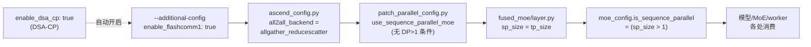
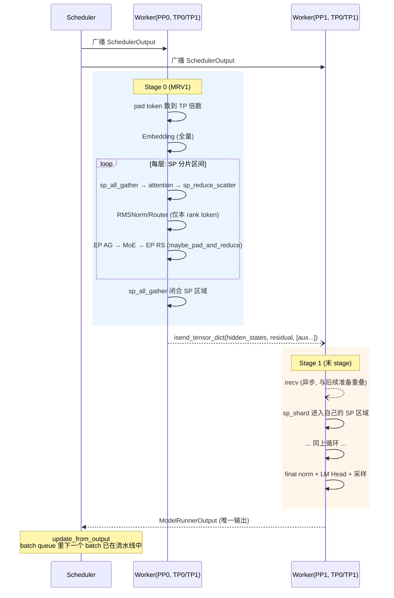

# PP 与 SP 代码走读（vLLM-Ascend）

> 本文基于以下两个仓库的 main 分支：
>
> - **vllm-ascend** @ `c40cf7bc1`（2026-10-08）
> - **vllm** @ `7d47ac2ddb`（2026-10-08）
>
> 阅读方法建议：每个代码片段前都标了 `文件路径:行号`。先通读本文建立主线，再打开源码对照；行号会随版本漂移，但函数名/类名是稳定的检索入口。原理不明白的地方回看《PP_SP_方案与原理》。

---

## 目录

- [0. 全景代码地图](#0-全景代码地图)
- [1. PP 走读：从参数到执行](#1-pp-走读从参数到执行)
  - [1.1 配置与并行组初始化](#11-配置与并行组初始化)
  - [1.2 层划分：每个 rank 拿哪些层](#12-层划分每个-rank-拿哪些层)
  - [1.3 模型构建：切开的模型长什么样](#13-模型构建切开的模型长什么样)
  - [1.4 执行链路（V1）：一次 step 的完整旅程](#14-执行链路v1一次-step-的完整旅程)
  - [1.5 Ascend 侧的 worker 与 model runner](#15-ascend-侧的-worker-与-model-runner)
  - [1.6 MRV2：PPHandler 与 pp_transport](#16-mrv2pphandler-与-pp_transport)
  - [1.7 Ascend 特有的 PP 细节](#17-ascend-特有的-pp-细节)
- [2. SP 走读：从开关到算子](#2-sp-走读从开关到算子)
  - [2.1 开关链路：enable_flashcomm1 到底打开了什么](#21-开关链路enable_flashcomm1-到底打开了什么)
  - [2.2 基础算子：上游标准 SP 算子与 Ascend 封装](#22-基础算子上游标准-sp-算子与-ascend-封装)
  - [2.3 Token 对齐：padding 的三条防线](#23-token-对齐padding-的三条防线)
  - [2.4 模型层接入：DeepSeek-V4 与 Kimi K3](#24-模型层接入deepseek-v4-与-kimi-k3)
  - [2.5 MoE 层：SP 的主战场](#25-moe-层sp-的主战场)
  - [2.6 图模式兼容](#26-图模式兼容)
- [3. PP × SP 组合走读](#3-pp--sp-组合走读)
- [4. 测试索引](#4-测试索引)
- [5. 总结：一次 forward 的全景](#5-总结一次-forward-的全景)

---

## 0. 全景代码地图

vLLM-Ascend 是 vLLM 的硬件插件，所以 PP/SP 的骨架在上游 vllm 仓库，Ascend 侧做开关、算子和执行器的适配。

```mermaid
flowchart TB
    subgraph UP["vllm 上游 (vllm/)"]
        direction TB
        PC["parallel_config<br/>--pipeline-parallel-size"]
        PS["distributed/parallel_state.py<br/>并行组初始化 / GroupCoordinator"]
        PU["distributed/utils.py<br/>get_pp_indices 层划分"]
        MU["model_executor/models/utils.py<br/>make_layers / PPMissingLayer"]
        ENG["v1/engine/core.py<br/>Scheduler + batch queue"]
        EXE["v1/executor/*<br/>SchedulerOutput 广播"]
        GMR["v1/worker/gpu_model_runner.py<br/>执行入口（参考实现）"]
        SPOPS["models/common/ops/sequence_parallel.py<br/>标准 SP 算子"]
        MOECFG["model_executor/layers/fused_moe/config.py<br/>FusedMoEParallelConfig.sp_size"]
    end
    subgraph ASC["vllm-ascend (vllm_ascend/)"]
        direction TB
        AC["ascend_config.py<br/>enable_flashcomm1 开关"]
        PATCH["patch/platform/patch_parallel_config.py<br/>use_sequence_parallel_moe 补丁"]
        WK["worker/worker.py<br/>AscendWorker.execute_model"]
        MR1["worker/model_runner_v1.py<br/>NPUModelRunner (MRV1)"]
        MR2["worker/v2/model_runner.py + pp_transport.py<br/>MRV2"]
        ASP["models/common/ops/sequence_parallel.py<br/>Ascend SP 自定义算子"]
        MODELS["models/kimi_k3.py, deepseek_v4/model.py<br/>模型级 SP 接入"]
        MOE["ops/fused_moe/prepare_finalize.py<br/>SP-MoE 数据面"]
        RCO["ops/register_custom_ops.py<br/>EP AG/RS 自定义算子"]
    end
    PC --> PS
    PC --> PATCH
    PC --> MOECFG
    PS --> MU
    PU --> MU
    MU --> MODELS
    ENG --> EXE --> WK
    AC --> PATCH
    PATCH --> MOECFG
    MOECFG --> MOE
    SPOPS --> ASP --> MODELS
    WK --> MR1
    WK --> MR2
    RCO --> MOE
    classDef pp fill:#e8f5e9,stroke:#2e7d32,color:#1b5e20
    classDef sp fill:#fff3e0,stroke:#ef6c00,color:#e65100
    class PC,PS,PU,MU,ENG,EXE,GMR,WK,MR1,MR2 pp
    class AC,PATCH,SPOPS,MOECFG,ASP,MODELS,MOE,RCO sp
```



两条主线：

- **PP 主线**（绿色系）：`parallel_config` → 并行组 → 层划分 → 模型构建 → 引擎调度 → worker 执行 → stage 间传输。
- **SP 主线**（橙色系）：`enable_flashcomm1` → `use_sequence_parallel_moe` 补丁 → MoE 配置 `sp_size` → SP 算子 → 模型/MoE 数据面。

---

## 1. PP 走读：从参数到执行

### 1.1 配置与并行组初始化

**入口参数**：`vllm serve --pipeline-parallel-size 2`（可组合 `--tensor-parallel-size`、`--data-parallel-size`）。层数不均衡时用环境变量 `VLLM_PP_LAYER_PARTITION="32,29"` 自定义（1.2 节）。

进程启动后，每个 worker 进程会调用上游的 `initialize_model_parallel` 创建各通信组。关键代码在 `vllm/distributed/parallel_state.py:2135` 附近：

```python
# vllm/distributed/parallel_state.py (节选, ~L2136)
# the layout order is: ExternalDP x DP x PP x PCP x TP
# ...
all_ranks = torch.arange(world_size).reshape(
    -1,
    data_parallel_size,
    pipeline_parallel_size,
    prefill_context_model_parallel_size,
    tensor_model_parallel_size,
)
```

这是一个 5 维 rank 张量，**越靠右的维度在 rank 编号上越连续**。也就是说：

- **TP 是最内层**：相邻 rank 属于同一个 TP 组 → 天然落在同一节点/同一 HCCS 域内；
- **PP 在 TP 外一层**：跨 TP 组取 stride 组成 PP 组。

以 `TP=2, PP=2, DP=1` 共 4 卡为例（rank 布局 `[PP=2, TP=2]`）：

```text
rank 张量:      [[0, 1],      PP rank 0
                 [2, 3]]      PP rank 1
TP 组: [0,1], [2,3]           （相邻，同节点）
PP 组: [0,2], [1,3]           （跨 TP 组）
```

接着创建 PP 组（`parallel_state.py:2253`）：

```python
# vllm/distributed/parallel_state.py (节选, L2253)
# Build the pipeline model-parallel groups.
global _PP
assert _PP is None, "pipeline model parallel group is already initialized"
group_ranks = (
    all_ranks.transpose(2, 4).reshape(-1, pipeline_model_parallel_size).unbind(0)
)
group_ranks = [x.tolist() for x in group_ranks]
_PP = init_model_parallel_group(
    group_ranks, get_world_group().local_rank, backend, group_name="pp"
)
```

`transpose(2, 4)` 把 PP 维换到 TP 维的位置再拉平——这就是"沿 PP 维切组"的实现。之后全代码通过 `get_pp_group()` 拿到这个 `GroupCoordinator`，它提供 stage 间通信的全部原语（`parallel_state.py:1379`）：

```python
# vllm/distributed/parallel_state.py (节选, L1379)
def send(self, tensor: torch.Tensor, dst: int | None = None) -> None:
    """Sends a tensor to the destination rank in a blocking way."""
    """NOTE: `dst` is the local rank of the destination rank."""
    if self.device_communicator is None:
        raise ValueError("No device communicator found")
    self.device_communicator.send(tensor, dst)

def recv(self, size: torch.Size, dtype: torch.dtype, src: int | None = None) -> torch.Tensor:
    """Receives a tensor from the source rank."""
    ...
```

在 Ascend 上 `device_communicator` 底层走 HCCL 的 P2P 通信。此外 `GroupCoordinator` 还提供整套张量字典传输接口——`send_tensor_dict` / `recv_tensor_dict` / 异步版 `isend_tensor_dict` / `irecv_tensor_dict` / `broadcast_tensor_dict`——PP 的 stage 间数据交换全部基于它们（见 1.5）。

> **为什么是"字典"而不是单个张量**：stage 边界传递的不只是 `hidden_states`，还有 `residual`（残差流）、spec decode 需要的 aux hidden states、共享 indexer 需要的 topk 索引等。用字符串键的字典做载体，扩展时不需要改传输协议——MRV2 的 `pp_transport` 正是靠这个扩展点实现的（1.6 节）。

### 1.2 层划分：每个 rank 拿哪些层

`vllm/distributed/utils.py:128` 的 `get_pp_indices` 决定 stage 边界：

```python
# vllm/distributed/utils.py (节选, L128)
def get_pp_indices(
    num_hidden_layers: int, pp_rank: int, pp_size: int
) -> tuple[int, int]:
    """Try to evenly distribute layers across partitions.

    If the number of layers is not divisible by the number of partitions,
    the remaining layers are evenly distributed across all but the last
    partition. The last partition is excluded because it often contains an
    additional norm layer and we are attempting to balance compute.
    ...
    """
    partition_list_str = envs.VLLM_PP_LAYER_PARTITION
    if partition_list_str is not None:
        try:
            partitions = [int(layer) for layer in partition_list_str.split(",")]
        except ValueError as err:
            raise ValueError("Invalid partition string: {}".format(partition_list_str)) from err
        if len(partitions) != pp_size:
            raise ValueError(f"{len(partitions)=} does not match {pp_size=}.")
        if sum(partitions) != num_hidden_layers:
            raise ValueError(f"{sum(partitions)=} does not match {num_hidden_layers=}.")
    else:
        layers_per_partition = num_hidden_layers // pp_size
        partitions = [layers_per_partition for _ in range(pp_size)]

        if remaining_layers := num_hidden_layers % pp_size:
            for i in range(2, remaining_layers + 2):
                partitions[-i] += 1
            ...
    start_layer = sum(partitions[:pp_rank])
    end_layer = start_layer + partitions[pp_rank]
    return (start_layer, end_layer)
```

两条路径：

1. **自动划分**：整除部分均分；余数从**倒数第二个 stage 开始**往前加（`partitions[-i] += 1`）。末 stage 不加层，因为它还要跑 final norm、LM head、logits、采样——这是刻意的负载均衡。
2. **手动划分**：`VLLM_PP_LAYER_PARTITION="32,29"`，要求条数 = PP size、总和 = 总层数，否则启动即报错。

61 层模型的划分结果（官方文档示例）：

```text
PP2: [31, 30]        → rank0: [0,31)  rank1: [31,61)
PP4: [15,15,16,15]   → rank2 多拿一层（中间 stage），首末不加
```

### 1.3 模型构建：切开的模型长什么样

#### 1.3.1 make_layers：把 ModuleList 切开

所有支持 PP 的模型都用 `make_layers` 构建 decoder 层列表（`vllm/model_executor/models/utils.py:878`）：

```python
# vllm/model_executor/models/utils.py (节选, L878)
def make_layers(
    num_hidden_layers: int,
    layer_fn: LayerFn,
    prefix: str,
) -> tuple[int, int, torch.nn.ModuleList]:
    from vllm.distributed.parallel_state import get_pp_group
    from vllm.distributed.utils import get_pp_indices
    from vllm.model_executor.offloader import get_offloader

    start_layer, end_layer = get_pp_indices(
        num_hidden_layers, get_pp_group().rank_in_group, get_pp_group().world_size
    )

    modules = torch.nn.ModuleList(
        [PPMissingLayer() for _ in range(start_layer)]
        + get_offloader().wrap_modules(
            layer_fn(prefix=f"{prefix}.{idx}") for idx in range(start_layer, end_layer)
        )
        + [PPMissingLayer() for _ in range(end_layer, num_hidden_layers)]
    )
    return start_layer, end_layer, modules
```

注意这个精巧的设计：**`ModuleList` 的长度永远等于总层数**，不属于本 stage 的位置用 `PPMissingLayer` 占位（一个 `torch.nn.Identity`，forward 原样返回输入）。好处是：

- 层的索引 `layers[i]` 与原始模型严格对齐，权重按名字加载时天然正确；
- KV cache 管理、spec decode 的 tap 层选择等按"全局层号"编写的逻辑无需感知 PP。

`PPMissingLayer` 定义就在上方（`utils.py:844`）：

```python
# vllm/model_executor/models/utils.py (节选, L844)
class PPMissingLayer(torch.nn.Identity):
    """A placeholder layer for missing layers in a pipeline parallel model."""

    def __init__(self, *args, **kwargs):
        super().__init__()

    def forward(self, *args, **kwargs):
        """Return the first arg from args or the first value from kwargs."""
        return args[0] if args else next(iter(kwargs.values()))
```

#### 1.3.2 SupportsPP：模型侧的 PP 合同

不是所有模型都能切层。上游用协议类 `SupportsPP`（`vllm/model_executor/models/interfaces.py:753`）声明"我可以被 PP"：

```python
# vllm/model_executor/models/interfaces.py (节选, L753)
@runtime_checkable
class SupportsPP(Protocol):
    """The interface required for all models that support pipeline parallel."""

    supports_pp: ClassVar[Literal[True]] = True
    """
    A flag that indicates this model supports pipeline parallel.
    ...
    """

    make_empty_intermediate_tensors: _MakeEmptyIntermediateTensors
    """Called when PP rank > 0 for profiling purposes."""

    def forward(
        self,
        input_ids: Tensor | None,
        positions: Tensor,
        *,
        intermediate_tensors: "IntermediateTensors | None",
    ) -> "Tensor | IntermediateTensors | tuple[Tensor, list[Tensor]]":
        """Accept [`IntermediateTensors`][vllm.sequence.IntermediateTensors] when
        PP rank > 0.

        Return [`IntermediateTensors`][vllm.sequence.IntermediateTensors] only
        for the last PP rank.
        """
        ...
```

合同包含三点：

1. `forward` 接受 `intermediate_tensors`（非首 rank 的输入）；
2. `forward` 返回 `IntermediateTensors`（非末 rank 的输出）；
3. `make_empty_intermediate_tensors` 能造出"空壳"中间张量——profiling/dummy run 时非首 rank 还没收到真数据，需要空壳占位（见 1.7）。

`IntermediateTensors` 本质是 `dict[str, Tensor]` 的包装（键如 `"hidden_states"`、`"residual"`），这就是 stage 间传输的"信封"。

#### 1.3.3 模型 forward 的 PP 边界

以 Qwen2/Qwen3 为例（`vllm/model_executor/models/qwen2.py`，`Qwen2Model.forward`）：

```python
# vllm/model_executor/models/qwen2.py (节选)
def forward(
    self,
    input_ids: torch.Tensor | None,
    positions: torch.Tensor,
    intermediate_tensors: IntermediateTensors | None = None,
    inputs_embeds: torch.Tensor | None = None,
) -> torch.Tensor | IntermediateTensors:
    if get_pp_group().is_first_rank:
        if inputs_embeds is not None:
            hidden_states = inputs_embeds
        else:
            hidden_states = self.embed_input_ids(input_ids)
        residual = None
    else:
        assert intermediate_tensors is not None
        hidden_states = intermediate_tensors["hidden_states"]
        residual = intermediate_tensors["residual"]

    ...
    for idx, layer in enumerate(
        islice(self.layers, self.start_layer, self.end_layer),
        start=self.start_layer,
    ):
        hidden_states, residual = layer(positions, hidden_states, residual)
        ...

    if not get_pp_group().is_last_rank:
        return IntermediateTensors(
            {
                "hidden_states": hidden_states,
                "residual": residual,
                **self.pack_local_aux_hidden_states(aux_hidden_states),
            }
        )

    hidden_states, _ = self.norm(hidden_states, residual)
    ...
```

三段式结构，所有 PP 模型都长这样：

- **首 rank**：`input_ids` → embedding，`residual = None`；
- **非首 rank**：从 `intermediate_tensors` 拆出 `hidden_states` / `residual` 继续算；
- **非末 rank**：把输出打包成 `IntermediateTensors` 返回（交给 worker 发出去，见 1.5）；
- **末 rank**：跑 final norm，输出交给 `lm_head` + 采样。

权重加载与 KV cache 也随之"自动"按 stage 切开：`PPMissingLayer` 没有参数（`is_pp_missing_parameter` 判定），加载器跳过它们；KV cache 注册时只遍历本 stage 的真实层，所以**每个 rank 只为自己那几层分配 KV cache 显存**。

### 1.4 执行链路（V1）：一次 step 的完整旅程

现在看运行时。V1 引擎的 PP 执行模型是"**单点调度、广播执行、末段输出**"。

#### 第 1 站：EngineCore 与 batch queue

`vllm/v1/engine/core.py:210`：

```python
# vllm/v1/engine/core.py (节选, L209)
# Setup batch queue for pipeline parallelism.
# Batch queue for scheduled batches. This enables us to asynchronously
# schedule and execute batches, and is required by pipeline parallelism
# to eliminate pipeline bubbles.
self.batch_queue_size = vllm_config.max_concurrent_batches
self.batch_queue: (
    deque[tuple[Future[ModelRunnerOutput], SchedulerOutput, Future[Any]]] | None
) = None
if self.batch_queue_size > 1:
    logger.debug("Batch queue is enabled with size %d", self.batch_queue_size)
    self.batch_queue = deque(maxlen=self.batch_queue_size)
...
self.step_fn = (
    self.step if self.batch_queue is None else self.step_with_batch_queue
)
```

`max_concurrent_batches > 1` 时启用 batch queue：调度器可以连续调度多个 batch 进流水线而不阻塞等结果——这就是原理篇 3.3 说的 **in-flight micro-batching 填泡**。`step_with_batch_queue`（`core.py:670`）的逻辑概括为：

```text
1. 队列未满且还有请求可调度 → schedule 出新 batch，execute_model(non_block=True) 入队，
   立即返回空输出（填队列优先于取结果）；
2. 无新 batch 可调度（队列满或无请求）→ 阻塞等待队首 batch 的 future 完成；
3. 用队首输出 update_from_output。
```

#### 第 2 站：执行器广播

`vllm/v1/executor/multiproc_executor.py:340`：

```python
# vllm/v1/executor/multiproc_executor.py (节选, L340)
def execute_model(
    self, scheduler_output: SchedulerOutput, non_block: bool = False
) -> ModelRunnerOutput | None | Future[ModelRunnerOutput | None]:
    return self.collective_rpc(
        "execute_model",
        args=(scheduler_output,),
        unique_reply_rank=self.output_rank,
        non_block=non_block,
        ...
    )
```

`collective_rpc` 通过共享内存广播队列（`rpc_broadcast_mq`）把 `SchedulerOutput` **同时投递给所有 worker**（所有 TP×PP rank），但只从 `output_rank`（末 PP rank 的 rank 0）收取回复。**每个 PP rank 都运行同样的调度指令，各自执行自己的 stage**——这就是"单点调度、广播执行"。

#### 第 3 站：worker 收发（以上游 GPU worker 为参照）

上游参考实现在 `vllm/v1/worker/gpu_worker.py:1290` 附近：

```python
# vllm/v1/worker/gpu_worker.py (节选, ~L1312)
if forward_pass and not get_pp_group().is_first_rank:
    tensor_dict, comm_handles, comm_postprocess = (
        get_pp_group().irecv_tensor_dict(
            all_gather_group=get_tp_group(),
            all_gather_tensors=all_gather_tensors,
        )
    )
    assert tensor_dict is not None
    intermediate_tensors = AsyncIntermediateTensors(
        tensor_dict,
        comm_handles=comm_handles,
        comm_postprocess=comm_postprocess,
    )

with self.annotate_profile(scheduler_output):
    output = self.model_runner.execute_model(scheduler_output, intermediate_tensors)
    ...

# Non-blocking send of the intermediate tensors. The metadata handle
# is reaped lazily by the GroupCoordinator; the device handles are
# waited at the top of the next step.
handles = get_pp_group().isend_tensor_dict(
    output.tensors,
    all_gather_group=get_tp_group(),
    all_gather_tensors=all_gather_tensors,
)
self._pp_send_work = handles[1:]
```

要点：

- **非首 rank**：先发起**异步** `irecv_tensor_dict`（上一 stage 的激活），拿到的是 `AsyncIntermediateTensors`——句柄先记账，算子真正消费张量时才等待（通信与计算重叠）；
- **执行**：`model_runner.execute_model(scheduler_output, intermediate_tensors)`；
- **非末 rank**：`isend_tensor_dict` 异步发出输出，句柄留到下一步开头收尾（`_pp_send_work`），不阻塞当前 step。

### 1.5 Ascend 侧的 worker 与 model runner

vLLM-Ascend 的 `AscendWorker` 复刻了上述模式（`vllm_ascend/worker/worker.py:752`）：

```python
# vllm_ascend/worker/worker.py (节选, L752)
def execute_model(
    self,
    scheduler_output: "SchedulerOutput",
) -> ModelRunnerOutput | AsyncModelRunnerOutput | None:
    ...
    if self._pp_send_work:
        for handle in self._pp_send_work:
            handle.wait()
        self._pp_send_work = []

    intermediate_tensors = None
    forward_pass = scheduler_output.total_num_scheduled_tokens > 0
    if forward_pass and not get_pp_group().is_first_rank:
        if enable_sp():
            all_gather_group = None
        else:
            all_gather_group = get_tp_group()
        tensor_dict, comm_handles, comm_postprocess = get_pp_group().irecv_tensor_dict(
            all_gather_group=all_gather_group
        )
        assert tensor_dict is not None
        intermediate_tensors = AsyncIntermediateTensors(
            tensor_dict,
            comm_handles=comm_handles,
            comm_postprocess=comm_postprocess,
        )
    ...
    output = self.model_runner.execute_model(scheduler_output, intermediate_tensors)
    if isinstance(output, (ModelRunnerOutput, AsyncModelRunnerOutput, NoneType)):
        return output

    assert isinstance(output, IntermediateTensors)
    parallel_config = self.vllm_config.parallel_config
    assert parallel_config.distributed_executor_backend != ("external_launcher") and not get_pp_group().is_last_rank
    if enable_sp():
        all_gather_group = None
    else:
        all_gather_group = get_tp_group()
    self._pp_send_work = get_pp_group().isend_tensor_dict(
        output.tensors,
        all_gather_group=all_gather_group,
    )
    ...
```

与上游的差异只有一处，但很关键：**`enable_sp()` 时传 `all_gather_group=None`**。这个参数的语义是"发送方在 TP 域内去重"（只从 TP rank 0 发，接收侧再 AllGather 补齐，省 TP-1 份点对点流量）。开 SP 后不能这么干——因为模型在 stage 边界已经把 token 拼回全量（见第 3 章），各 TP rank 的张量内容虽然一致，但 SP 模型代码期待"每个 rank 都收到自己的那份传输"，路径上再插一次 AllGather 会破坏时序假设，干脆全员点对点。

> 追根溯源：上游 `vllm/v1/worker/utils.py:797` 的 `is_residual_scattered_for_sp` 决定 `residual` 这个键是否需要在发送时 TP 聚合——上游的 compile-SP 路径里 residual 可能以分片形态到达边界。Ascend 的模型级 SP 在边界处全部规约完毕，所以直接走 `None` 的朴素路径。

再往下是 `NPUModelRunner`（MRV1，`vllm_ascend/worker/model_runner_v1.py`）。它负责两件 PP 相关的事：

**其一，中间张量的长度同步**。`irecv` 收到的张量按" padded 长度"分配（为了对齐），真正有效的 token 数由 `SchedulerOutput` 决定，执行前要裁剪。`sync_and_slice_intermediate_tensors`（`model_runner_v1.py:3280`）：

```python
# vllm_ascend/worker/model_runner_v1.py (节选, L3280)
# Keep PP intermediate tensors local to the sequence-parallel shard.
def sync_and_slice_intermediate_tensors(
    self,
    num_tokens: int,
    intermediate_tensors: AsyncIntermediateTensors | None,
    sync_self: bool,
) -> IntermediateTensors:
    assert self.intermediate_tensors is not None
    ...
    if sync_self:
        # batch size (number of tokens) is the same for all ranks,
        # so we don't need to sync it
        for k, v in intermediate_tensors.items():
            ...
            if k not in self.intermediate_tensors.tensors:
                base_tensor = self.intermediate_tensors["hidden_states"]
                self.intermediate_tensors[k] = v.new_empty(
                    (base_tensor.shape[0], *v.shape[1:]), dtype=v.dtype
                )
            self.intermediate_tensors[k][:copy_len].copy_(v[:copy_len])
    ...
    return IntermediateTensors(
        {k: v[:num_tokens] for k, v in self.intermediate_tensors.items()}
    )
```

注意注释 "Keep PP intermediate tensors local to the sequence-parallel shard"——MRV1 上 SP 与 PP 组合受限（见 2.4 的 K3 条件），这段代码是为支持的场景保留分片语义的地方。

**其二，执行收尾**（`model_runner_v1.py:2613` 附近）：

```python
# vllm_ascend/worker/model_runner_v1.py (节选, ~L2613)
if not self.broadcast_pp_output:
    # Common case.
    if not get_pp_group().is_last_rank:
        # Return the intermediate tensors.
        assert isinstance(hidden_states, IntermediateTensors)
        hidden_states.kv_connector_output = kv_connector_output
        ...
        return hidden_states
    ...
    sample_hidden_states = hidden_states[logits_indices]
    logits = self.model.compute_logits(sample_hidden_states)
else:
    # Rare case.
    ...
```

- 常规路径：非末 rank 返回 `IntermediateTensors`（给 worker 发出去）；末 rank 计算 logits 并采样，返回 `ModelRunnerOutput`。
- 罕见路径 `broadcast_pp_output`：末 rank 把 logits 通过 `broadcast_tensor_dict` 广播给所有 rank（用于某些需要每个 rank 都拿到 logits 的特性，如 VLM/结构化输出的特殊路径）。

### 1.6 MRV2：PPHandler 与 pp_transport

Model Runner V2（`VLLM_USE_V2_MODEL_RUNNER=1` 开启，`vllm_ascend/worker/v2/model_runner.py`）与 V1 的本质区别是**有状态**：请求的 token 前缀、采样历史等由 runner 自身维护。这对 PP 是个新问题——**所有 stage 都需要知道"上一步采出了什么 token"**才能推进自己的状态，而采样只发生在末 stage。

上游的解法是 `PPHandler`（`vllm/v1/worker/gpu/pp_utils.py:52`）：

```python
# vllm/v1/worker/gpu/pp_utils.py (节选, L52)
class PPHandler:
    """Runs the PP sampled-token broadcast/recv on a side stream so the
    default stream isn't gated by the matching peer call. Step T's recv is
    consumed at step T+pp_size via `get_prev_sampled_outputs`.

    Uses a dedicated NCCL communicator (sibling of the PP `device_group`)
    for the broadcast so it does not serialize on the wire with the
    inter-stage hidden-state p2p send/recv ops.
    """

    def __init__(self, max_num_reqs: int, num_speculative_steps: int, device: torch.device):
        self.is_last_rank = get_pp_group().is_last_rank
        ...
        # On non-last ranks, a FIFO with one entry per in-flight step: the entry
        # pushed by step T's `receive` is consumed pp_size steps later. Pre-seeded
        # with pp_size None placeholders so the first pp_size consumes are no-ops.
        ...
        # Dedicated subgroup for the sampled-token broadcast.
        self.broadcast_group = get_pp_group().make_sibling_device_group(
            group_desc="pp_broadcast"
        )
        ...
```

三个设计点：

1. **独立通信域**（`make_sibling_device_group`）：sampled-token 广播与隐藏态 P2P 用不同 communicator，避免在线路上互相排队；
2. **侧流执行**：广播/接收跑在 side stream 上，不阻塞主流；
3. **错步消费**（环形队列深度 = pp_size）：step T 收到的 token 在 step T+pp_size 才被消费——正好是它"流完整个流水线"回来的时候，巧妙对齐了时序。

Ascend 侧的 MRV2 叠加了 spec decode 的需求：drafter（EAGLE3/DSpark）挂在末 stage，但它需要的 **aux hidden states 来自中间层**——中间层可能在前面的 stage 上。`vllm_ascend/worker/v2/pp_transport.py` 把 `IntermediateTensors` 扩展为通用传输通道：

```python
# vllm_ascend/worker/v2/pp_transport.py (节选, L149)
class PPTransportDataType(str, Enum):
    """Data types carried between PP ranks via ``IntermediateTensors``."""

    AUX_HIDDEN_STATES = "aux_hidden_states"
    TOPK_INDICES = "topk_indices"
```

```python
# vllm_ascend/worker/v2/pp_transport.py (节选, L291)
def add_pp_transport_tensors(
    intermediate_tensors: IntermediateTensors,
    data_type: PPTransportDataType,
    tensors: Sequence[torch.Tensor],
) -> IntermediateTensors:
    """Add tensors of one transport type to a PP payload."""
    key_prefix = _get_transport_key_prefix(data_type)
    for index, tensor in enumerate(tensors):
        intermediate_tensors.tensors[f"{key_prefix}{index}"] = tensor
    return intermediate_tensors
```

以 `pp_transport_aux_hidden_states_0`、`pp_transport_aux_hidden_states_1`… 为键，把中间层捕获的 hidden states 塞进同一个"信封"，随常规的 `hidden_states`/`residual` 一起跨 stage 传输；接收侧 `get_pp_transport_tensors` 按序拆出。这样 DSpark 的 tap 层、EAGLE3 的 aux 层即使落在前面的 stage，drafter 在末 stage 也能拿到输入。

同文件还有 `SpecPPSupport` 注册表（`_SPEC_PP_SUPPORT_BY_METHOD`），声明每种投机解码方法与 PP 叠加的能力（支持哪些架构、是否需要 aux hidden states、是否绕过上游 guard），是查阅"PP×SpecDecode 支持矩阵"的权威代码位置。

### 1.7 Ascend 特有的 PP 细节

**Dummy run / profiling 的 PP 处理**（`vllm_ascend/worker/worker.py:985` 注释）："PP0 includes all the pipeline stages' latency when using async scheduling"——profile 计时只看首 stage 的日志时要记得它涵盖了全链路。非首 rank 在 dummy run 时还没有收到真激活，靠模型的 `make_empty_intermediate_tensors` 造空壳张量走通图捕获/profiling（`model_runner_v1.py:4205` 附近：非首 rank 若无缓存则调用 `self.model.make_empty_intermediate_tensors(...)` 构造）。

**KV cache 只建本 stage 的层**：`register_all_kvcache_specs` 遍历模型时 `PPMissingLayer` 不产出 attention/ KV spec，因此各 rank 的 KV cache 配置天然按层划分。一个副作用：**stage 边界如果切在非块大小对齐处**，上下游的 KV block 布局需要重新对齐（上游 `kv_cache_utils.py` 会用 `VLLM_PP_LAYER_PARTITION` 提示 realign stage 边界）。

**P/D 分离 × PP**：PP 只放 prefill 节点（decode 节点 PP=1）。Mooncake connector 的拓扑描述里要如实写 prefill 的 PP size 和层划分（两侧配置一致），KV 迁移时 connector 会按 (pp_rank, tp_rank) 精确投递——`core.py:195` 附近 `set_xfer_handshake_metadata_pp_aware` 的注释可见 `{(pp_rank, tp_rank): metadata}` 的结构。

**DCPP（动态分块流水线）**：`profiling_chunk_config` 要求 `pp > 1`（`ascend_config.py:696` 的校验），按实测执行时间动态调整 prefill chunk 大小，减少 stage 空转。这是昇腾对长文本 prefill + PP 场景的专门优化，详见官方 `dynamic_chunked_pipeline_parallel` 文档。

---

## 2. SP 走读：从开关到算子

### 2.1 开关链路：enable_flashcomm1 到底打开了什么

SP 的入口是一个容易误解的名字。当前 main 分支上，**`enable_flashcomm1` 只是 SP-MoE 的总开关**，与历史上的 FlashComm 私有实现已无关系。完整链路分四跳：

**第一跳：读开关，改 all2all backend**（`vllm_ascend/ascend_config.py:724`）：

```python
# vllm_ascend/ascend_config.py (节选, L724)
# FlashComm remains the SP MoE switch on Ascend.
flashcomm_explicitly_enabled = validate_additional_config_bool(
    (vc.additional_config or {}).get("enable_flashcomm1", False),
    "additional_config.enable_flashcomm1",
) or os.getenv("VLLM_ASCEND_ENABLE_FLASHCOMM1", "0").strip().lower() in ("1", "true")
# DSA-CP depends on FlashComm: auto-enable FlashComm when DSA-CP is on
# so users only need `enable_dsa_cp=true` in additional_config.
if self.enable_dsa_cp and not flashcomm_explicitly_enabled:
    logger.info_once("DSA-CP is enabled. Auto-enabling FlashComm .")

effective_flashcomm = flashcomm_explicitly_enabled or self.enable_dsa_cp

if not effective_flashcomm:
    vllm_config.parallel_config.all2all_backend = (
        "flashinfer_all2allv"  # TODO: a tricky way to disable SP moe. Disable this when SP is supported.
    )
    logger.info_once("FlashComm1 is disabled. Using flashinfer_all2allv as the all2all backend.")
elif not vc.parallel_config.use_sequence_parallel_moe:
    logger.warning_once("FlashComm1 is enabled, but the current config does not support sp MoE. Disabling")
else:
    logger.info_once("FlashComm1 is enabled.")
```

注意三点：

1. 开关来自 `--additional-config '{"enable_flashcomm1": true}'`（环境变量 `VLLM_ASCEND_ENABLE_FLASHCOMM1` 仍兼容但文档已不再推荐）；
2. **DSA-CP（DeepSeek 稀疏注意力的上下文并行）隐依赖 SP 的 token 布局**，开 DSA-CP 会自动开 SP；
3. 关闭时把 `all2all_backend` 强制成 `flashinfer_all2allv`——一个不满足 SP 判定的 backend，从而间接关掉 SP（代码里的 TODO 自嘲 "a tricky way"）。

**第二跳：patch 掉上游的 DP>1 限制**（`vllm_ascend/patch/platform/patch_parallel_config.py`）：

```python
# vllm_ascend/patch/platform/patch_parallel_config.py (全文节选)
def _use_sequence_parallel_moe(self: ParallelConfig) -> bool:
    """Enable MoE sequence parallelism for TP/EP topologies, including DP=1."""
    return (
        self.all2all_backend
        in (
            "allgather_reducescatter",
            "deepep_high_throughput",
            "deepep_low_latency",
            "deepep_v2",
            "flashinfer_nvlink_one_sided",
            "mori_high_throughput",
            "mori_low_latency",
            "nixl_ep",
        )
        and self.enable_expert_parallel
        and self.tensor_parallel_size > 1
    )


# Upstream additionally requires data_parallel_size > 1. On Ascend, FlashComm
# supports the TP/EP, DP=1 topology and still needs SP's rank-local token layout.
ParallelConfig.use_sequence_parallel_moe = property(_use_sequence_parallel_moe)
```

对照上游 `vllm/config/parallel.py:751`：上游的 `use_sequence_parallel_moe` 多一个 `and self.data_parallel_size > 1`。这个 monkey-patch 把它去掉，让**单副本（DP=1）的 TP/EP 拓扑也能开 SP**——这是昇腾上最常见的部署形态（PR #17061）。patch 的理由写在注释里：Ascend FlashComm 时代就支持 DP=1 的 rank-local token 布局，行为已验证。

**第三跳：并行判定进入 MoE 配置**（`vllm/model_executor/layers/fused_moe/layer.py:43`）：

```python
# vllm/model_executor/layers/fused_moe/layer.py (节选, L43)
def make_parallel_config(
    tp_size: int | None,
    dp_size: int | None,
    pcp_size: int | None,
    is_sequence_parallel: bool,
    parallel_config: ParallelConfig,
) -> FusedMoEParallelConfig:
    ...
    sp_size = tp_size_ if is_sequence_parallel else 1

    moe_parallel_config = FusedMoEParallelConfig.make(
        tp_size_=tp_size_,
        pcp_size_=pcp_size_,
        dp_size_=dp_size_,
        sp_size_=sp_size_,
        vllm_parallel_config=parallel_config,
    )

    assert moe_parallel_config.is_sequence_parallel == is_sequence_parallel
    ...
```

**第四跳：`sp_size` 成为 MoE 层的属性**（`vllm/model_executor/layers/fused_moe/config.py:1022`）：

```python
# vllm/model_executor/layers/fused_moe/config.py (节选, L1022)
@property
def is_sequence_parallel(self) -> bool:
    return self.sp_size > 1
```

此后所有 MoE 代码只问 `self.moe_config.is_sequence_parallel`。另外 `vllm_ascend/utils.py:980` 提供了便捷谓词：

```python
# vllm_ascend/utils.py (节选, L980)
def enable_sp(vllm_config=None) -> bool:
    if vllm_config is None:
        try:
            from vllm.config import get_current_vllm_config
            vllm_config = get_current_vllm_config()
        except AssertionError:
            vllm_config = None
    if vllm_config is None:
        return False
    return bool(vllm_config.parallel_config.use_sequence_parallel_moe)
```

全链路一张图：



### 2.2 基础算子：上游标准 SP 算子与 Ascend 封装

**上游标准算子**（`vllm/models/common/ops/sequence_parallel.py`）是四个纯函数：

```python
# vllm/models/common/ops/sequence_parallel.py (全文节选)
def sp_all_gather(x: torch.Tensor) -> torch.Tensor:
    output = _custom_collective("custom_all_gather", x)
    if output is not None:
        return output
    return tensor_model_parallel_all_gather(x, 0)

def sp_reduce_scatter(x: torch.Tensor) -> torch.Tensor:
    assert x.ndim == 2
    tp_size = get_tensor_model_parallel_world_size()
    sp_pad = (-x.shape[0]) % tp_size
    if sp_pad > 0:
        x = torch.nn.functional.pad(x, (0, 0, 0, sp_pad))
    output = _custom_collective("custom_reduce_scatter", x)
    if output is not None:
        return output
    return tensor_model_parallel_reduce_scatter(x, 0)

def sp_shard(x: torch.Tensor) -> torch.Tensor:
    tp_size = get_tensor_model_parallel_world_size()
    tp_rank = get_tensor_model_parallel_rank()
    sp_pad = (-x.shape[0]) % tp_size
    if sp_pad > 0:
        pad = (0, 0) * (x.ndim - 1) + (0, sp_pad)
        x = torch.nn.functional.pad(x, pad)
    chunk = x.shape[0] // tp_size
    return x[tp_rank * chunk : (tp_rank + 1) * chunk]

def sp_padding_mask(is_padding, hidden_states) -> torch.Tensor:
    ...
```

语义：

| 算子 | 语义 | 用在哪 |
| --- | --- | --- |
| `sp_all_gather(x)` | 把各 rank 的 token 分片拼回全量（走 TP 域 AG） | attention 入口前 |
| `sp_reduce_scatter(x)` | 行切出口的部分和：pad 后 TP 域 RS，得到本 rank 分片 | attention/MLP 出口（替代 AR） |
| `sp_shard(x)` | **本地**切出本 rank 的 token 分片（无通信，纯切片） | 已有全量张量时（如 PP 边界收到的激活） |
| `sp_padding_mask(is, hs)` | 切分 padding mask，与 `sp_shard` 行对齐 | 标记假 token |

`_custom_collective` 的作用是：如果当前平台的 `DeviceCommunicator` 提供了融合/定制版本（如 CUDA 上的 symm-mem 通信），优先走定制路径，否则回退标准 HCCL/NCCL 集合通信。

**Ascend 封装**（`vllm_ascend/models/common/ops/sequence_parallel.py`）把 `sp_shard` / `sp_reduce_scatter` / `sp_padding_mask` 注册成 **torch custom op**：

```python
# vllm_ascend/models/common/ops/sequence_parallel.py (节选)
def _ascend_sp_shard_impl(x: torch.Tensor) -> torch.Tensor:
    """Pad the token axis (dim 0) to the TP multiple, then take this rank's chunk."""
    tp_size = get_tensor_model_parallel_world_size()
    tp_rank = get_tensor_model_parallel_rank()
    sp_pad = (-x.shape[0]) % tp_size
    # Upstream counterpart: vllm/models/common/ops/sequence_parallel.py
    # sp_shard L45-48 (introduced in 38a466e7b6, #46789).
    if sp_pad > 0:
        x = F.pad(x, (0, 0) * (x.ndim - 1) + (0, sp_pad))
    chunk = x.shape[0] // tp_size
    out = x[tp_rank * chunk : (tp_rank + 1) * chunk]
    return out.clone() if sp_pad == 0 else out

def _ascend_sp_shard_fake(x: torch.Tensor) -> torch.Tensor:
    tp_size = get_tensor_model_parallel_world_size()
    shape = list(x.shape)
    shape[0] = cdiv(x.shape[0], tp_size)
    return torch.empty(shape, dtype=x.dtype, device=x.device)

direct_register_custom_op(
    op_name="ascend_sp_shard_impl",
    op_func=_ascend_sp_shard_impl,
    mutates_args=[],
    fake_impl=_ascend_sp_shard_fake,
    dispatch_key="PrivateUse1",
)

def sp_shard(x: torch.Tensor) -> torch.Tensor:
    """Shard the token axis across TP ranks for sequence parallelism."""
    return torch.ops.vllm.ascend_sp_shard_impl(x)
```

为什么要多此一层注册？`sp_shard` 里有一个**依赖运行时数值的分支**（`sp_pad = (-x.shape[0]) % tp_size` 是否大于 0）。昇腾的图模式（torchair/ACL graph）用 dynamo 追踪 Python 代码，**data-dependent 的形状操作会把具体 shape "烤"进图里**，换一个 batch 大小就失配。注册成 custom op 后：

- 真实实现（`_impl`）对 dynamo 是黑盒，pad 分支不可见；
- `fake_impl` 给出形状规则（`cdiv(T, tp)`），图捕获/导出时用假张量推形状；
- `out.clone() if sp_pad == 0` 避免从 functional custom op 返回输入的视图（另一个 dynamo 陷阱）。

文件里的注释原话："A custom op keeps the modulo padding invisible to dynamo (same shape-baking hazard as `sp_shard`)"。

### 2.3 Token 对齐：padding 的三条防线

SP 要求各 rank token 数相等，工程上有三条防线配合：

**防线一：调度侧补齐**（`vllm_ascend/worker/model_runner_v1.py:3267`）：

```python
# vllm_ascend/worker/model_runner_v1.py (节选, L3267)
def _pad_for_sequence_parallelism(self, num_scheduled_tokens: int) -> int:
    # Pad tokens to multiple of tensor_parallel_size when
    # enabled collective fusion for SP
    tp_size = self.vllm_config.parallel_config.tensor_parallel_size
    # Native MoE SP and DSA-CP shard tokens at different boundaries, but
    # both require equal token counts on every TP rank.
    if enable_sp(self.vllm_config) or enable_dsa_cp():
        return round_up(num_scheduled_tokens, tp_size)
    return num_scheduled_tokens
```

开 SP 时把本 step 的 token 数向上取整到 TP 的倍数，补出的行是假 token。配套地，`ascend_config.py:781` 还会把 `max_num_batched_tokens` 回调到 `TP × PCP` 的整数倍（打印 warning）。

**防线二：padding mask 跟随切分**。假 token 会进 LayerNorm/Router，必须可辨识。mask 以 `forward_context.is_padding` 全局携带，在切分点用 `sp_padding_mask` 同步行布局（见 2.4 K3 代码）。

**防线三：MoE 侧跳过假 token**（上游 `vllm/envs.py`，默认开启）：

```python
# vllm/envs.py (节选)
# Skip cudagraph/DP padding tokens in the MoE path by forcing their expert
# ids to -1 so the dispatch and experts drop them. Requires a MoE kernel that
# treats topk_id == -1 as a skip sentinel
"VLLM_MOE_SKIP_PADDING": lambda: bool(int(os.getenv("VLLM_MOE_SKIP_PADDING", "1"))),
```

假 token 的 expert id 被置 `-1`，dispatch 与专家计算直接丢弃，不做无用功。

### 2.4 模型层接入：DeepSeek-V4 与 Kimi K3

SP 在模型层的选择性接入（哪些算子跑在分片区）是模型代码自己的责任。看两个代表。

**DeepSeek-V4：attention 边界的 AG/RS**

```python
# vllm_ascend/models/deepseek_v4/model.py (节选, ~L760)
residual = hidden_states.clone()
full_num_tokens = positions.shape[0]
hidden_states, post, comb = self.hc_pre(hidden_states, self.hc_attn_fn, self.hc_attn_scale, self.hc_attn_base)
hidden_states = self.input_layernorm(hidden_states)

if self.use_sequence_parallel_moe and not self.enable_dsa_cp:
    hidden_states = sp_all_gather(hidden_states)[:full_num_tokens]

attn_kwargs = {"positions": positions, "hidden_states": hidden_states, "llama_4_scaling": llama_4_scaling}
hidden_states = self.self_attn(**attn_kwargs)

if self.use_sequence_parallel_moe and not self.enable_dsa_cp:
    hidden_states = sp_reduce_scatter(hidden_states)
...
```

标准模式：进 attention 前 `sp_all_gather` 拼全量（裁掉 pad 行），出来后 `sp_reduce_scatter` 回分片。`enable_dsa_cp` 打开时 token 布局由 CP 接管（另一套边界），所以跳过这两个调用。模型 forward 的入口处还有对 `input_ids` 的切分（`sp_shard(input_ids)`——hash 路由类 MoE 需要按 token id 路由，id 也要分行布局）。

**Kimi K3：全 SP 化的教科书案例**

K3 的 SP 条件在模型构建处（`vllm_ascend/models/kimi_k3.py:714`）：

```python
# vllm_ascend/models/kimi_k3.py (节选, L712)
# vLLM's generic MoE SP switch currently requires DP > 1. K3 also
# needs the same rank-local token layout for the TP/EP, DP=1 topology
# that FlashComm used before the standard SP operators were available.
parallel_config = vllm_config.parallel_config
self.use_sequence_parallel = (
    (parallel_config.pipeline_parallel_size == 1 or vllm_config.use_v2_model_runner)
    and parallel_config.enable_expert_parallel
    and parallel_config.tensor_parallel_size > 1
)
```

注意 K3 **不看 `use_sequence_parallel_moe`**（因为它不经过通用 MoE SP 路径，自己实现了全部 SP 数据面），且条件里写着 **PP 约束：`PP == 1` 或使用 MRV2**——MRV1 + PP>1 的组合在 K3 SP 下不支持（MRV1 的 PP 中间张量路径没有为 K3 的 SP 布局做适配，MRV2 的 pp_transport 做了）。

三个接入点：

*（a）Dense MLP：不开 TP 切分，改为 SP 全量计算*（`kimi_k3.py:150`）：

```python
# vllm_ascend/models/kimi_k3.py (节选, L150)
def __init__(self, ..., reduce_results: bool = True, ..., use_sequence_parallel: bool = False) -> None:
    super().__init__(
        ...,
        reduce_results=False if use_sequence_parallel else reduce_results,
        ...
    )
    self.use_sequence_parallel = use_sequence_parallel

def forward(self, x: torch.Tensor) -> torch.Tensor:
    if self.use_sequence_parallel:
        # All weight shards must operate on the same tokens. Reducing
        # different sequence shards would mix live and padding rows.
        x = sp_all_gather(x)
    x = super().forward(x)
    if self.use_sequence_parallel:
        x = sp_reduce_scatter(x)
    return x
```

K3 的 dense MLP 有意不做 TP 行切（`reduce_results=False` + 关闭 TP shard），因为 SP 下每个 rank 只看 1/N 的 token，全量权重算 1/N token 的总量 = TP 切分算全量 token 的总量，计算量持平，但省掉了行切出口的 AllReduce。

*（b）attention：o_proj 不再 AllReduce*（`kimi_k3.py:620`）：

```python
# vllm_ascend/models/kimi_k3.py (节选, L620)
if self.use_sequence_parallel:
    hidden_states = sp_all_gather(hidden_states)
    hidden_states = hidden_states[: positions.shape[0]]
hidden_states = self.self_attn(
    hidden_states=hidden_states,
    positions=positions,
)
if self.use_sequence_parallel and not self.fuse_o_proj_mm_reduce_scatter:
    hidden_states = sp_reduce_scatter(hidden_states)
```

构造函数里配套 `self.self_attn.o_proj.reduce_results = False`。`fuse_o_proj_mm_reduce_scatter` 是进一步融合：把 o_proj 的矩阵乘和 ReduceScatter 融合成一个算子（需要硬件支持 `MM_REDUCE_SCATTER` 能力），少一次显存往返。

*（c）MoE：走通用机制*（`kimi_k3.py:268`）：

```python
# vllm_ascend/models/kimi_k3.py (节选, L268)
self.experts = FusedMoEFactory(
    ...,
    is_sequence_parallel=use_sequence_parallel,
)
```

### 2.5 MoE 层：SP 的主战场

通用 MoE 的 SP 数据面在 `vllm_ascend/ops/fused_moe/prepare_finalize.py`。类 docstring 本身就是最好的文档（`L351`）：

```python
# vllm_ascend/ops/fused_moe/prepare_finalize.py (节选, L351)
class PrepareAndFinalizeWithAllGather(PrepareAndFinalize):
    """
    MoE communication strategy using All-Gather + Reduce-Scatter on EP group.
    There are two sets of prepare and finalize:
    1. _prepare_with_dp_group/_finalize_with_dp_group: When sequence parallelism is not enabled,
    we gather inputs across DP ranks before MoE, scatter outputs after.
    The communication and calculation process is as follows (AG, AR and RS
    are abbreviations for All-Gather, All-Reduce and Reduce-Scatter, respectively):

    Attn → TP AR → DP AG → MoE → DP RS → TP AR

    2. _prepare_with_ep_group/_finalize_with_ep_group: When sequence parallelism is enabled,
    the above process becomes:

    TP AG → Attn → TP RS → TP AG → DP AG → MoE → DP RS → TP RS

    This strategy further combines TP AG + DP AG into EP All-Gather and TP RS + DP RS
    into EP Reduce-Scatter to improve communication performance. The optimized process is as follows:

    TP AG → Attn → TP RS → EP AG → MoE → EP RS
    """
```

这就是原理篇 4.4 那张图的代码出处：SP 开启后 AG/RS 升级到 **EP 域**（合并了 TP 与 DP 两次小通信）。选择逻辑（`L373`）：

```python
# vllm_ascend/ops/fused_moe/prepare_finalize.py (节选, L373)
def _use_ep_sequence_parallel(self) -> bool:
    """Whether MoE itself must use the EP sequence-parallel path.

    The MoE configuration owns sequence-parallel tokens.  Selecting the
    EP path from any other flag would gather tokens a second time before
    routing.
    """
    return self.moe_config.is_sequence_parallel

def prepare(self, hidden_states, router_logits, replace_allreduce=False, quant_type=QuantType.NONE):
    if self._use_ep_sequence_parallel():
        return self._prepare_with_ep_group(hidden_states, router_logits, quant_type)
    return self._prepare_with_dp_group(hidden_states, router_logits, replace_allreduce)
```

注意 docstring 的警告："Selecting the EP path from any other flag would gather tokens a second time"——**token 布局的所有权**在 MoE 配置手上，模型层不能各自为政地切分/聚合，否则会重复 gather。这是排查 SP 相关 bug 时的重要线索。

`_prepare_with_ep_group`（`L401`）的核心是两个自定义算子：

```python
# vllm_ascend/ops/fused_moe/prepare_finalize.py (节选, L401)
def _prepare_with_ep_group(self, hidden_states, router_logits, quant_type=QuantType.NONE) -> MoEPrepareOutput:
    pertoken_scale = None
    if quant_type == QuantType.W8A8:
        hidden_states, pertoken_scale = torch_npu.npu_dynamic_quant(hidden_states)
    ...
    hidden_states = torch.ops.vllm.maybe_all_gather_and_maybe_unpad(hidden_states)
    router_logits = torch.ops.vllm.maybe_all_gather_and_maybe_unpad(router_logits)
    ...
```

```python
# vllm_ascend/ops/fused_moe/prepare_finalize.py (节选, L538)
def _finalize_with_ep_group(self, hidden_states: torch.Tensor) -> torch.Tensor:
    """
    Argument `reduce_results` is not needed in this func. Given sequence parallelism is enabled:
    1. Reduce_results is False usually happens when models have shared experts and need to
    allreduce hidden states after results of shared experts and routed experts are added in FusedMoe.
    We do reduce scatter for hidden states here, then skip allreudce in FusedMoe and add it to the
    result of shared experts.
    2 Reduce_results is True usually happens when model has no shared experts. We still do reduce scatter
    here, then skip allreudce in FusedMoe.
    """
    hidden_states = torch.ops.vllm.maybe_pad_and_reduce(hidden_states)
    return hidden_states
```

`maybe_all_gather_and_maybe_unpad` / `maybe_pad_and_reduce` 的实现（`vllm_ascend/ops/register_custom_ops.py:56`）：

```python
# vllm_ascend/ops/register_custom_ops.py (节选, L56)
def _maybe_all_gather_and_maybe_unpad_impl(x: torch.Tensor) -> torch.Tensor:
    """EP communication only: EP all_gather followed by unpad according to the DP token distribution."""
    forward_context = get_forward_context()
    dp_metadata = forward_context.dp_metadata
    ep_group = get_ep_group()
    local_sizes = _get_ep_local_sizes(dp_metadata, ep_group)
    if local_sizes is not None:
        max_local_size = max(local_sizes)
        # all_gather requires equal-length inputs on every rank: pad to
        # max_local_size first, then trim back to each rank's real local size.
        x = _pad_to_ep_local_size(x, max_local_size)
    # need to unpad from ep size
    x = ep_group.all_gather(x, 0)
    if dp_metadata is not None:
        if local_sizes is not None:
            x = x.view(len(local_sizes), max(local_sizes), *x.shape[1:])
            x = torch.cat([x[idx, :size] for idx, size in enumerate(local_sizes)], dim=0)
        ...
    return x

def _maybe_pad_and_reduce_impl(x: torch.Tensor) -> torch.Tensor:
    """EP communication only: pad according to the DP token distribution, then EP reduce_scatter."""
    ...
    if local_sizes is not None:
        max_local_size = max(local_sizes)
        padded_x = x.new_zeros((len(local_sizes), max_local_size, *x.shape[1:]))
        offset = 0
        for idx, size in enumerate(local_sizes):
            padded_x[idx, :size] = x[offset : offset + size]
            offset += size
        reduced = ep_group.reduce_scatter(padded_x.view(-1, *x.shape[1:]), 0)
        # The collective needs equal-sized chunks, while the next
        # sequence-parallel layer expects this rank's original token count.
        return reduced[: local_sizes[ep_group.rank_in_group]]
    ...
```

要处理的核心难题是**各 rank token 数不齐**：集合通信要求等长输入，所以先 pad 到组内最大值，gather 完再按各 rank 的真实长度 `unpad` 拼回"逻辑连续"的全量 token 序列；反向同理。DP 元数据（`dp_metadata.num_tokens_across_dp_cpu`）来自 forward context，由 model runner 在每次 forward 时写入。

最后一个关键协调点：**谁负责最后的 reduce**。SP 下 MoE 出口已经 RS 过了，再走 TP AllReduce 就错了。`register_custom_ops.py:123`：

```python
# vllm_ascend/ops/register_custom_ops.py (节选, L123)
def _routed_output_is_reduced(layer_name: str) -> bool:
    runner = get_forward_context().no_compile_layers[layer_name]
    is_sequence_parallel = runner.moe_config.is_sequence_parallel
    comm = _EXTRA_CTX.moe_comm_type
    return comm in {
        MoECommType.MC2,
        MoECommType.ALLTOALL,
        MoECommType.FUSED_MC2,
    } or (comm == MoECommType.ALLGATHER and is_sequence_parallel)

def _maybe_all_reduce_tensor_model_parallel_impl(states, layer_name) -> torch.Tensor:
    """Reduce routed/final output only if dispatch has not already reduced it."""
    if _routed_output_is_reduced(layer_name):
        return states
    return tensor_model_parallel_all_reduce(states)

def _maybe_all_reduce_shared_expert_impl(shared_output, layer_name) -> torch.Tensor:
    """Reduce shared TP output separately when routed output is already reduced."""
    if _routed_output_is_reduced(layer_name):
        return tensor_model_parallel_all_reduce(shared_output)
    return shared_output
```

SP 开启时 routed 输出在 `finalize` 里已经 RS（等于已 reduce），所以跳过它的 AllReduce；但 **shared expert 的输出此时还没 reduce**（它在 TP 域复制计算），换成对 shared 输出做 AllReduce。两个 `_maybe_all_reduce_*` 算子成对出现，保证"恰好 reduce 一次"。

### 2.6 图模式兼容

除了 2.2 的 custom op 手段，昇腾编译管线还有一个 SP 相关的清理 pass（`vllm_ascend/compilation/passes/allgather_chunk_noop_pass.py`）：

```python
# vllm_ascend/compilation/passes/allgather_chunk_noop_pass.py (节选)
class AllGatherChunkNoOpCleanupPass(VllmInductorPass):
    """Fold all_gather + sequence_parallel_chunk_impl into identity."""

    def _register_patterns(self) -> None:
        def pattern(input: torch.Tensor) -> torch.Tensor:
            gathered = self._all_gather(input)
            return torch.ops.vllm.sequence_parallel_chunk_impl(gathered)

        def replacement(input: torch.Tensor) -> torch.Tensor:
            return input

        pm.register_replacement(pattern, replacement, [self._empty(8, 16)], pm.fwd_only, self.patterns)
```

模式匹配"AG 之后立刻取自己的 chunk"（gather 完再切回自己那份 = 什么都没干）并折叠为恒等映射，消除图模式中残留的无效通信。这类 noop 模式在 SP 分支与各模型代码的组合中很容易产生，编译期统一清理。

---

## 3. PP × SP 组合走读

组合的枢纽在 **K3 模型 forward 的边界处理**（`vllm_ascend/models/kimi_k3.py:845`），这段代码同时用了本文出现过的几乎所有构件，值得逐行读：

```python
# vllm_ascend/models/kimi_k3.py (节选, L845)
full_num_tokens = positions.shape[0]
if get_pp_group().is_first_rank:
    hidden_states = inputs_embeds if inputs_embeds is not None else self.embed_input_ids(input_ids)
    residual = None
else:
    assert intermediate_tensors is not None
    hidden_states = intermediate_tensors["hidden_states"]
    residual = intermediate_tensors["residual"]

materialized_aux = self.dspark_aux_capture_materialized
aux_hidden_states = get_pp_transport_tensors(intermediate_tensors, PPTransportDataType.AUX_HIDDEN_STATES)
if self.use_sequence_parallel:
    if envs.VLLM_MOE_SKIP_PADDING and is_forward_context_available():
        forward_context = get_forward_context()
        # Every stage starts with a full-token padding mask, even
        # though only the first stage starts with full activations.
        forward_context.is_padding = sp_padding_mask(
            forward_context.is_padding,
            positions,
        )
    # Every stage starts from full-sequence tensors - the previous
    # stage closed its sequence-parallel region at the boundary -
    # and keeps its own shard afterwards, matching DeepSeek V4.
    hidden_states = sp_shard(hidden_states)
    if residual is not None:
        residual = sp_shard(residual)
    aux_hidden_states = [sp_shard(aux) for aux in aux_hidden_states]
```

**stage 入口**（PP 视角 + SP 视角）：

1. 从 `intermediate_tensors` 拆出 `hidden_states` / `residual`（PP）；
2. 从信封里拆出 DSpark/EAGLE3 需要的 aux hidden states（`pp_transport`）；
3. 用 `sp_padding_mask` 建立/对齐 padding mask（假 token 标记）；
4. `sp_shard` 把全量激活**本地切分**成 SP 分片——注意这里用的是无通信的 `sp_shard` 而不是 `sp_all_gather`，因为收到的本来就是全量张量。

**stage 出口**（`kimi_k3.py:922`）：

```python
# vllm_ascend/models/kimi_k3.py (节选, L922)
if not get_pp_group().is_last_rank:
    if self.use_sequence_parallel:
        # The next PP rank expects full-sequence tensors; close the
        # sequence-parallel region before crossing the boundary so the
        # upstream PP transport only sees replicated tensors.
        hidden_states = sp_all_gather(hidden_states)[:full_num_tokens]
        residual = sp_all_gather(residual)[:full_num_tokens]
        aux_hidden_states = [sp_all_gather(aux)[:full_num_tokens] for aux in aux_hidden_states]
    return add_pp_transport_tensors(
        IntermediateTensors({"hidden_states": hidden_states, "residual": residual}),
        PPTransportDataType.AUX_HIDDEN_STATES,
        aux_hidden_states,
    )
```

**闭合 SP 区域**（`sp_all_gather` 拼回全量，裁掉 pad 行）再打包发送——注释说得很清楚："the upstream PP transport only sees replicated tensors"，PP 传输协议不需要理解 SP。这与 1.5 节 worker 侧 `enable_sp() → all_gather_group=None` 遥相呼应：模型保证边界处是复制张量，worker 用朴素点对点即可。

配套测试 `tests/ut/models/test_kimi_k3_pp_sp.py`（605 行）覆盖了 PP×SP 的层布局与数值正确性，是改动相关代码后必跑的单测。

---

## 4. 测试索引

| 测试 | 位置 | 覆盖 |
| --- | --- | --- |
| PP e2e（2 卡） | `tests/e2e/pull_request/two_card/test_pipeline_parallel.py` | DS3-Lite，PP2 × {mp, ray} 后端，输出对齐基线 |
| PP×SP 单测 | `tests/ut/models/test_kimi_k3_pp_sp.py` | K3 的 PP+SP 层划分、边界闭合、数值 |
| PP 传输单测 | `tests/ut/worker/v2/test_pp_transport.py` | MRV2 pp_transport 的 aux/topk 接力 |
| SP-MoE prepare/finalize | `tests/ut/ops/test_prepare_finalize.py` | EP AG/RS 的 pad/unpad 逻辑 |
| SP-MoE e2e | `tests/e2e/cases/models/configs/Qwen/Qwen3-32B-W8A8C8-A3.yaml` 等 | `enable_flashcomm1:true` 的真实部署（含图模式组合） |
| 层划分 | `tests/ut/...`（上游 `vllm/distributed/utils.py` 对应测试） | `get_pp_indices` 的自动/手动划分 |


## 5. 总结：一次 forward 的全景

最后把两条线合成一张图——**PP=2、TP=2、SP 开启**时，一次 decode step 的数据全景：

