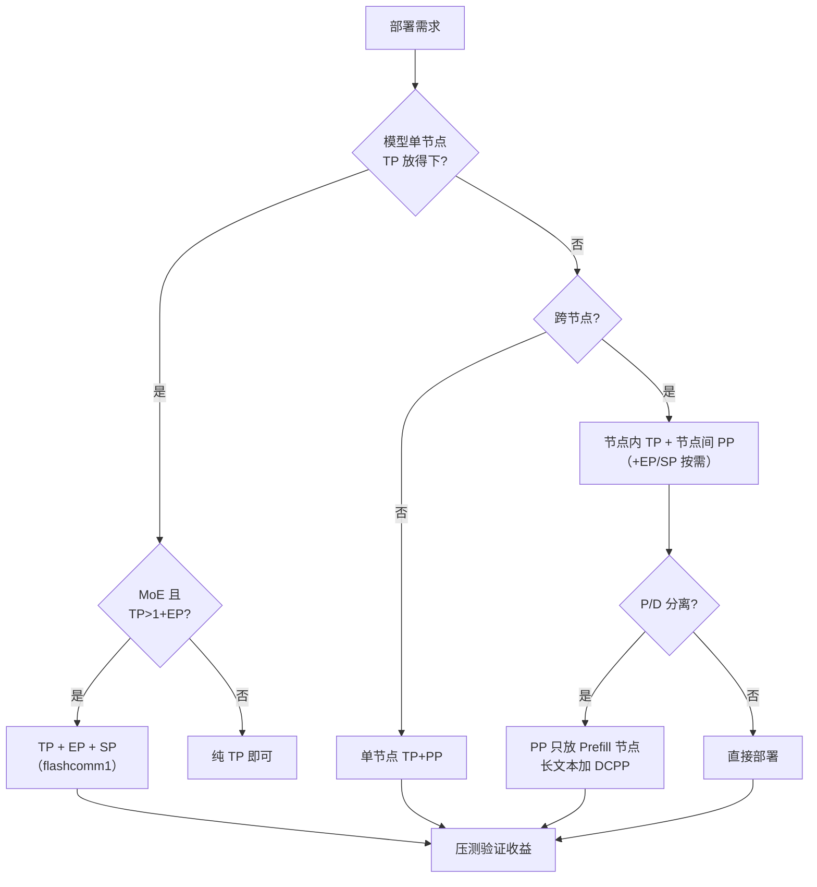

# PP 与 SP 使用指南（vLLM-Ascend）

> 适用范围：vllm-ascend main 分支（2026-10，基线 commit `c40cf7bc1`）。
> 本文回答"怎么用"：如何部署、什么场景用、怎么调优、出了问题查哪里。原理请看《PP_SP_方案与原理》，实现细节请看《PP_SP_代码走读》。
>
> 权威英文文档对照：[Pipeline Parallelism](https://docs.vllm.ai/projects/ascend/en/latest/user_guide/feature_guide/pipeline_parallel.html) · [Sequence Parallelism](https://docs.vllm.ai/projects/ascend/en/latest/user_guide/feature_guide/sequence_parallelism.html)

---

## 目录

- [1. 简介](#1-简介)
- [2. 部署](#2-部署)
- [3. 常见应用场景](#3-常见应用场景)
- [4. 最佳实践](#4-最佳实践)
- [5. FAQ](#5-faq)

---

## 1. 简介

### 1.1 一页看懂 PP 与 SP

| | PP（流水线并行） | SP（序列并行） |
| --- | --- | --- |
| 做什么 | 把 Transformer 层切成 P 段，每段一组卡，激活依次流过 | 把 batch 的 token 按序列维度切到各 TP rank，每卡只算 1/N 的 token |
| 解决什么 | 模型单节点/单 TP 组放不下；跨节点部署要通信局部性 | TP 拓扑下激活全量复制导致的冗余计算与通信（MoE 尤甚） |
| 代价 | 流水线气泡、单请求延迟上升、拓扑/兼容约束 | 通信模式复杂化、padding 开销、对图模式与模型接入有要求 |
| 显存收益 | 权重 + KV Cache 都按层切分 | 层内激活显存降为 1/N |
| 典型搭档 | 节点内 TP + 节点间 PP；P/D 分离的 Prefill 节点 | TP>1 + EP 的 MoE 模型；大 MoE 的 decode 提速 |

### 1.2 vLLM-Ascend 支持现状

**PP：**

- 启用条件：模型实现声明 `SupportsPP` 接口（能切层、能收发中间激活）。
- 模型家族（Ascend 实现或验证）：

| 模型家族 | 状态 |
| --- | --- |
| DeepSeek-V4 / V4.1 | Ascend 实现（文本、多模态、MTP drafter 变体） |
| GLM-5.2/5.3/5.3-Flash | Ascend 实现 |
| MiniMax-M3 | Ascend 实现（sparse 文本 + 多模态） |
| Qwen3.6 | 上游实现 |
| Kimi K3 | 上游实现 + Ascend 适配 |

其余模型只要上游实现继承了 `SupportsPP`，在 Ascend 上行为一致；启动时会做检查，不支持的模型直接拒绝 PP，不会带病运行。逐模型状态以官方 [Supported Models](https://docs.vllm.ai/projects/ascend/en/latest/user_guide/support_matrix/supported_models.md) 矩阵为准。

**SP：**

当前 SP 覆盖 **MoE 路径（SP-MoE）**，分两类：

| 类型 | 适用模型 | 启用条件 | 是否需要开关 |
| --- | --- | --- | --- |
| 通用 MoE SP | DeepSeek-V4/V4.1、GLM-5.x、Qwen3.5/3.6、MiniMax 等走通用 FusedMoE 路径的 MoE | `TP > 1` + `--enable-expert-parallel` + `additional_config.enable_flashcomm1: true` | 需要 |
| Kimi K3 模型级 SP | Kimi K3（含多模态） | `TP > 1` + `--enable-expert-parallel`（自动启用；`PP=1` 或 MRV2 下可用） | 不需要 |

与上游 vLLM 的差异：上游的 MoE SP 额外要求 `DP > 1`；Ascend 通过 patch 去掉了这个限制，**DP=1 的纯 TP/EP 拓扑同样可以开 SP**（这是单副本部署最常用的形态）。

> 历史包袱说明：开关名 `enable_flashcomm1` 沿用自昇腾早期的 FlashComm 私有实现。如今它只是"SP-MoE 总开关"，底层已全部跑上游标准 SP 算子。更早的 FlashComm v2（`VLLM_ASCEND_FLASHCOMM2_PARALLEL_SIZE`、`layer_sharding`）已在 2026-07 从代码库移除，旧资料里的相关配置请直接忽略。

---

## 2. 部署

### 2.1 前置条件

**硬件/软件：**

- Atlas 800T A2 / A3 等 910 系列服务器（SP 与 PP 的组合特性以具体型号验证为准）；
- CANN / torch_npu / vllm-ascend 版本匹配，参考官方[安装文档](https://docs.vllm.ai/projects/ascend/en/latest/getting_started/installation.html)；
- 多机部署时：所有节点使用**相同**的 vLLM、vllm-ascend、模型权重、Python 环境；HCCL 通信正常（`hccn_tool` 可用，参数面网络互通）。

**拓扑检查清单（启动前）：**

- [ ] 可见 NPU 数量 ≥ `DP × PP × TP`（`ASCEND_RT_VISIBLE_DEVICES` 或容器 device 挂载）；
- [ ] PP 与 TP 的组合满足模型约束（如头数整除、MoE 专家数整除）；
- [ ] *多机 MP*：所有节点能访问头节点 `--master-addr:port`；
- [ ] *多机 Ray*：Ray 集群健康，每节点资源视图包含全部 NPU。

### 2.2 PP：快速开始

#### 单机最小示例（2 卡）

```bash
export ASCEND_RT_VISIBLE_DEVICES=0,1

vllm serve /path/to/model \
    --tensor-parallel-size 1 \
    --pipeline-parallel-size 2 \
    --trust-remote-code
```

每个 stage 用一个 TP 组。`TP4 PP2` 需要 8 卡，以此类推。

#### 双机 MP 后端（不依赖 Ray）

TP 保持在节点内（8 卡），PP 跨节点（2 个 stage）：

```bash
# Node 0（头节点，node-rank 0）
vllm serve /path/to/model \
    --distributed-executor-backend mp \
    --tensor-parallel-size 8 \
    --pipeline-parallel-size 2 \
    --nnodes 2 \
    --node-rank 0 \
    --master-addr <HEAD_NODE_IP> \
    --master-port <MASTER_PORT> \
    --trust-remote-code

# Node 1（工作节点，node-rank 1，必须带 --headless）
vllm serve /path/to/model \
    --distributed-executor-backend mp \
    --tensor-parallel-size 8 \
    --pipeline-parallel-size 2 \
    --nnodes 2 \
    --node-rank 1 \
    --master-addr <HEAD_NODE_IP> \
    --master-port <MASTER_PORT> \
    --headless \
    --trust-remote-code
```

只有头节点起 API server。两侧的模型、TP、PP、`--nnodes`、`--master-addr`、`--master-port` 必须完全一致，`--node-rank` 各节点唯一。

#### 多机 Ray 后端

先起 Ray 集群（各节点设置好通信环境变量后再启动），然后只在头节点执行：

```bash
vllm serve /path/to/model \
    --distributed-executor-backend ray \
    --tensor-parallel-size 8 \
    --pipeline-parallel-size 2 \
    --trust-remote-code
```

#### 层划分（可选）

默认自动均分（余数层从倒数第二个 stage 往前分配，末 stage 不加层）。手动控制用环境变量：

```bash
export VLLM_PP_LAYER_PARTITION="32,29"   # 例如一个61 层模型，PP2

vllm serve /path/to/61-layer-model \
    --tensor-parallel-size 8 \
    --pipeline-parallel-size 2 \
    --trust-remote-code
```

约束：条数 = PP size；总和 = 目标模型隐层数（不含 embedding/norm/LM head/draft 层）；同一实例所有 worker 一致；Ray 集群每个节点都要设置；改动需重启。违反即启动失败。

### 2.3 SP：快速开始

#### 通用 MoE 模型（DeepSeek-V4、GLM、Qwen3.5 等）

```bash
vllm serve <moe-model> \
    --data-parallel-size 1 \
    --tensor-parallel-size 2 \
    --enable-expert-parallel \
    --additional-config '{"enable_flashcomm1": true}'
```

三个条件缺一不可：`TP > 1`、`--enable-expert-parallel`、`enable_flashcomm1: true`。

注意配套项：

- `max_num_batched_tokens` 应能被 `TP`（若同时用 PCP 则为 `TP × PCP`）整除，否则框架自动向上调整并打 warning；
- 长上下文的 DeepSeek 稀疏模型若开 `enable_dsa_cp`，会**自动**开启 SP，无需重复设置。

#### Kimi K3（模型级 SP，自动生效）

```bash
vllm serve <kimi-k3-model> \
    --tensor-parallel-size 16 \
    --enable-expert-parallel \
    ...  # 其余参数见官方 Kimi-K3 教程
```

K3 的 SP 只要 `TP > 1 + EP` 就自动启用，**不需要**（也看不到）`enable_flashcomm1` 开关。若要 `PP > 1` 与 SP 同时使用，必须开 MRV2：

```bash
export VLLM_USE_V2_MODEL_RUNNER=1
```

### 2.4 验证部署

**看启动日志（最直接）：**

| 特性 | 生效日志 | 未生效日志 |
| --- | --- | --- |
| SP（通用路径） | `FlashComm1 is enabled.` | `FlashComm1 is disabled. Using flashinfer_all2allv as the all2all backend.` |
| SP 条件不满足 | —— | `FlashComm1 is enabled, but the current config does not support sp MoE. Disabling` |
| PP | 启动横幅打印 `pipeline_parallel_size=2`；各 rank 日志显示不同的层区间（如 `[0, 31)` / `[31, 61)`） | —— |

**功能验证：**

```bash
curl http://localhost:8000/v1/completions \
  -H "Content-Type: application/json" \
  -d '{"model": "<served-model-name>", "prompt": "Hello, my name is", "max_tokens": 32}'
```

与单卡/纯 TP 基线对比输出（e2e 测试 `test_pipeline_parallel.py` 就是这么做的：PP2 × {mp, ray} 与基线逐 token 对比）。

---

## 3. 常见应用场景

### 场景 1：模型单节点放不下 → TP + PP 跨节点

**背景**：61 层 MoE 大模型，单节点 8 卡 TP8 不够放（权重 + KV Cache 超 8 卡总量），需要 2 个节点。

**拓扑**：节点内 TP8，节点间 PP2。高频 AllReduce 全部留在节点内 HCCS 域，跨节点只剩 stage 边界的低频点对点。

```bash
# 两个节点，Ray 后端
vllm serve /path/to/61-layer-model \
    --distributed-executor-backend ray \
    --tensor-parallel-size 8 \
    --pipeline-parallel-size 2 \
    --additional-config '{"enable_flashcomm1": true}' \
    --trust-remote-code
```

**预期收益**：容量上达成部署；性能上优于 TP16 跨节点（前提是负载有足够并发填泡）。注意若同时开 EP，跨节点 RoCE 上的 `MoeDistributeDispatch` 路径目前不支持 PP 与 DP 同时 >1——这种拓扑下二选一。

### 场景 2：P/D 分离的 Prefill 节点扩容 → PP（可选 + DCPP）

**背景**：Prefill 节点要处理长文本，显存和算力吃紧；Decode 节点追求低延迟、保持简单拓扑。

**拓扑**：Prefill 节点 `TP8 PP2`，Decode 节点 `PP1`。长 prefill 的 chunk 是天然 micro-batch，PP 气泡占比小。

```bash
# Prefill 节点（MooncakeConnectorV1 时代需两侧如实描述 prefill 拓扑）
vllm serve /path/to/model \
    --tensor-parallel-size 8 \
    --pipeline-parallel-size 2 \
    --kv-transfer-config '{
        "kv_connector": "MooncakeConnectorV1",
        "kv_role": "kv_producer",
        "prefill": {"dp_size": 1, "tp_size": 8, "pp_size": 2, "pp_layer_partition": "32,29"},
        "decode": {"dp_size": 1, "tp_size": 8, "pp_size": 1}
    }' \
    --trust-remote-code
```

要点：`prefill.pp_size` / `pp_layer_partition` 在 P、D 两侧配置一致；Decode 侧 `pp_size` 恒为 `1`，**不要**把 prefill 的 `VLLM_PP_LAYER_PARTITION` 抄给 PP1 的 decode 进程。若长文本 TTFT 仍是瓶颈，再加 DCPP（`profiling_chunk_config`，要求 `pp > 1`），按实测耗时动态调整 chunk。

### 场景 3：MoE 模型 decode/吞吐提效 → SP

**背景**：`Qwen3-235B` / DeepSeek-V4 类大 MoE，TP>1 + EP 部署。不开 SP 时，o_proj AllReduce 之后每个 rank 都持有全量 token，EP dispatch 的通信和计算按副本数放大。

**拓扑**：任意 TP/EP 拓扑（DP=1 即可），加一个开关：

```bash
vllm serve <moe-model> \
    --tensor-parallel-size 8 \
    --enable-expert-parallel \
    --additional-config '{"enable_flashcomm1": true}' \
    --compilation-config '{"cudagraph_mode": "FULL_DECODE_ONLY"}'
```

**预期收益**（经验值，以实测为准）：MoE 层通信量下降、每卡 token 处理量降为 1/N，decode 吞吐提升；与 `FULL_DECODE_ONLY` 图模式兼容（e2e 已有 `Qwen3-32B-W8A8C8` + flashcomm1 + npugraph 的组合用例）。

### 场景 4：Kimi K3 大 MoE → SP（+ PP on MRV2）

**背景**：K3 类超大 MoE，需要 EP 分专家 + SP 省 MoE 开销；单副本放不下时叠 PP。

```bash
# PP>1 与 SP 组合必须 MRV2
export VLLM_USE_V2_MODEL_RUNNER=1

vllm serve <kimi-k3-model> \
    --tensor-parallel-size 8 \
    --pipeline-parallel-size 2 \
    --enable-expert-parallel \
    --trust-remote-code
```

SP 由模型自动启用。MRV1（默认）下 K3 的 SP 仅支持 `PP=1`；开 PP 就切 MRV2。配套单测 `tests/ut/models/test_kimi_k3_pp_sp.py` 可用于验证改动。

### 场景 5：DeepSeek 稀疏注意力长序列 → SP × DSA-CP

**背景**：DeepSeek-V3.2/V4 的 DSA（稀疏注意力）长序列场景，DSA-CP 依赖 SP 的 rank-local token 布局。

```bash
vllm serve <deepseek-v4-model> \
    --tensor-parallel-size 16 \
    --enable-expert-parallel \
    --additional-config '{"enable_dsa_cp": true}' \
    --trust-remote-code
```

`enable_dsa_cp` 会**自动**开启 SP（日志可见 `DSA-CP is enabled. Auto-enabling FlashComm.`）。官方已提示 DSA-CP 将来会被 PCP（Prefill Context Parallel）取代，新部署可关注 PCP 迁移路径（`--prefill-context-parallel-size`）。

---

## 4. 最佳实践

### 4.1 选型决策树



核心原则：

1. **PP 是最后手段的容量技术**：模型放得下就先纯 TP，加 PP 前后各压一轮测；
2. **SP 是低风险的效率技术**：MoE + TP>1 + EP 的拓扑默认建议开（配合压测确认收益）；
3. 高并发/长 prefill 的吞吐场景 PP 表现好；低并发纯 decode 的延迟场景慎用 PP。

### 4.2 PP 调优

**层均衡四步法：**

1. 从自动划分开始测试，以自动划分作为基线；
2. 用代表负载记录每个 PP rank 的峰值显存与 step 耗时（`npu-smi`、日志、msProbe profile）；
3. 末 stage 是瓶颈时，`VLLM_PP_LAYER_PARTITION` 一次挪一层（如 `[31,30]` → `[32,29]`）；
4. 每次改动后重跑精度 + 性能验证。

注意：末 stage 还要跑 final norm、LM head、logits、采样，可能还有投机解码 drafter——只按显存均衡划分往往错，要按延迟均衡。也不要一次挪太多层（瓶颈会转移）。

**填泡相关：**

- PP 的吞吐依赖 batch queue（in-flight micro-batching），队列深度自动取 PP size（MRV2 + 异步调度时为 PP+1），无需手工设置；日志出现 `Batch queue is enabled with size N` 即确认启用；
- 长文本场景确认 chunked prefill 开启（默认开），多个 chunk 是填泡原料；
- 注意 MRV1 对"异步调度 + PP"的支持不完整（上游代码注释明示），MRV1 下 PP 按非异步路径跑 pp_size 个并发 batch；
- DCPP（动态分块）适合长文本 prefill 的 PP 场景，按实测耗时自适应 chunk 大小。

**与投机解码叠加**：drafter（MTP/EAGLE3/DSpark）永远挂在**末 stage**，不参与层划分；末 stage 内存紧张时用自定义划分减层。DSpark 的 tap 层跨 stage 时由 `pp_transport` 自动接力，但自定义 `VLLM_PP_LAYER_PARTITION` 时要保证 tap 列表仍落在目标模型层内。特性叠加的权威矩阵见官方 pipeline_parallel 文档的 "Feature stacked with PP" 表（MRV2 下：MTP/DCP/KVPP/prefix caching/async scheduling/SP 支持；PCP 与 PP 互斥；DFlash 不支持）。

### 4.3 SP 调优

1. **整除性**：`--max-num-batched-tokens` 设为 TP 的倍数（PCP 叠加时为 `TP × PCP` 倍数），避免框架静默上调；
2. **图模式**：SP 与 `FULL_DECODE_ONLY` 图模式兼容并推荐搭配（decode 是收益主力）；`VLLM_MOE_SKIP_PADDING` 默认开，保持默认即可（padding 行在 MoE dispatch 处被丢弃）；
3. **量化**：W8A8/W8A8C8 等量化路径与 SP 兼容（prepare 阶段会先做 per-token 量化再 AG，量化 scale 一并聚合）；
4. **验证生效**：确认日志 `FlashComm1 is enabled.`；若看到 `... does not support sp MoE. Disabling`，逐项检查三个启用条件；
5. **收益确认**：对比开关前后 decode 吞吐（`benchmark_serving`）与 MoE 层通信量（profile）。

---

## 5. FAQ

**Q1：`enable_flashcomm1` 设了但 SP 没生效？**
日志出现 `FlashComm1 is enabled, but the current config does not support sp MoE. Disabling`。逐项检查：`--tensor-parallel-size > 1`？`--enable-expert-parallel` 加了吗？模型是不是 MoE 且走通用 FusedMoE 路径？Dense 模型的通用 SP 已随 FlashComm v2 移除，当前 dense 侧只有 Kimi K3 这类模型级实现。

**Q2：FlashComm1 和 FlashComm2 是什么关系？我该用哪个？**
FlashComm v2（以存换通信 + o_proj layer sharding）已于 2026-07 整体移除，`VLLM_ASCEND_FLASHCOMM2_PARALLEL_SIZE`、`layer_sharding` 等配置全部失效。现在只有 `enable_flashcomm1`，且它只是 SP-MoE 开关的名字，底下是上游标准 SP 算子。

**Q3：为什么上游文档说 MoE SP 需要 `--data-parallel-size > 1`，我 DP=1 也能开？**
vLLM-Ascend patch 掉了这个条件（PR #17061）：昇腾的 FlashComm 时代就验证过 TP/EP + DP=1 的 rank-local token 布局。行为等价，放心用。

**Q4：PP 启动时第一个请求就 hang？**
按序排查：多机 MP 下 worker 命令是否带 `--headless`、`--master-addr/port` 两端一致且端口可达；Ray 下各节点环境/模型路径/通信变量是否一致；HCCL 建链是否正常。快速二分法：`--enforce-eager` 排除图捕获问题；减小 `--max-model-len` 与 batch 上限排除资源问题。

**Q5：某个 PP rank OOM，其他 rank 正常？**
大概率是末 stage：它额外持有 final norm、LM head、logits、采样（可能还有 drafter）。用 `npu-smi` 确认是哪个 rank，然后 `VLLM_PP_LAYER_PARTITION` 从末 stage 一次挪一层到前面。也检查 `--max-num-seqs`（logits/采样显存随 batch 走）。

**Q6：`VLLM_PP_LAYER_PARTITION` 启动被拒？**
校验规则：条数 = `--pipeline-parallel-size`；每项正整数；总和 = 模型隐层数（`config.json` 的 `num_hidden_layers`，不含 embedding/norm/LM head/draft）。Ray 集群要求每个节点都设置同样的值。

**Q7：PP 和 SP 能同时用吗？**
能，且是推荐组合（e2e/单测覆盖）。注意两点：Kimi K3 的 SP 在 `PP > 1` 时必须 `VLLM_USE_V2_MODEL_RUNNER=1`（MRV1 不支持该组合）；实现上模型会在 stage 边界自动把 token 拼回全量再传输，无需人工干预。

**Q8：PP 能和 P/D 分离、投机解码、prefix caching 叠加吗？**
可以，但各有约束：P/D——PP 只放 Prefill 节点，Decode 必须 `PP1`，Mooncake 拓扑描述两侧一致；投机解码——drafter 挂末 stage，DSpark tap 层可跨 stage 接力；prefix caching——支持。PCP（prefill context parallel）与 PP 互斥。完整矩阵看官方文档 "Feature stacked with PP" 表。

**Q9：开 SP 后精度掉了 / 输出乱码？**
先确认不是 padding 问题：`max-num-batched-tokens` 是否被自动上调（日志有 warning）？版本是否包含 SP padding 修复（2026 年中密集修过一批：维度不匹配、MTP finalize 布局等，保持用最新版）。仍异常时用 `--enforce-eager` 排除图模式，并报 issue 附最小复现配置。

**Q10：PP 下日志时间怎么解读？**
异步调度时首 stage（PP0）的 step 日志涵盖了全链路延迟（激活要流完所有 stage 才算完），不要拿 PP0 单 rank 的耗时当作单 stage 耗时做均衡判断；用各 rank 配对的时间戳或 profiling 工具看分段。

**Q11：SP 对显存有帮助吗？**
有但有限：层内激活降为 1/N（对大 batch/长序列的 prefill 有感），但权重、KV Cache 不受 SP 影响。显存不够优先考虑 TP/PP/量化/KV offload，SP 的定位是通信与计算提效。

**Q12：怎么确认我的模型支持 PP？**
启动即知（不支持的模型会直接报错拒绝）。提前确认：查官方 Supported Models 矩阵的 Pipeline Parallel 列，或在模型实现里搜 `SupportsPP`。

---

## 附录：术语速查

| 术语 | 含义 |
| --- | --- |
| stage / PP rank | 层区间的一段 / 该段在 PP 组内的序号 |
| `IntermediateTensors` | stage 间传递的中间激活（hidden_states、residual 等）的信封 |
| batch queue | 引擎的 in-flight micro-batching 队列，PP 消气泡的关键 |
| SP-MoE | MoE 路径的序列并行（token 分片 + EP AG/RS） |
| rank-local token | SP 下每个 rank 持有的那 1/N token 分片 |
| MRV1 / MRV2 | Model Runner V1（默认）/ V2（`VLLM_USE_V2_MODEL_RUNNER=1`，有状态） |
| DCP / PCP / DSA-CP | 解码/预填充上下文并行 / DeepSeek 稀疏注意力 CP |
| DCPP | 动态分块流水线并行（按实测耗时调 chunk） |
| KVPP (LayerSplit) | 层级 KV 并行 |
