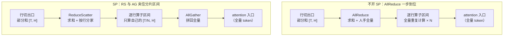
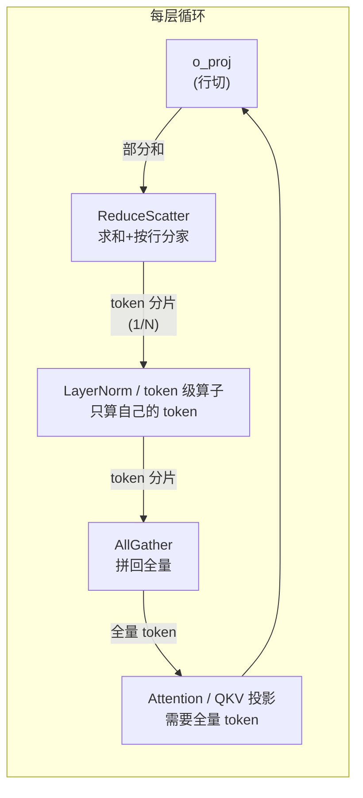
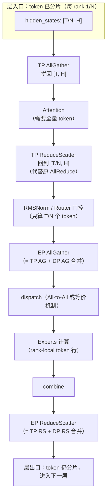
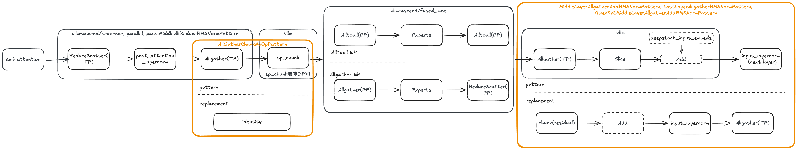
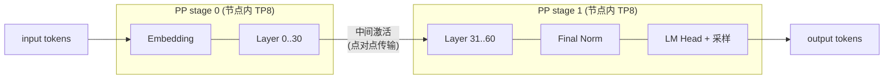
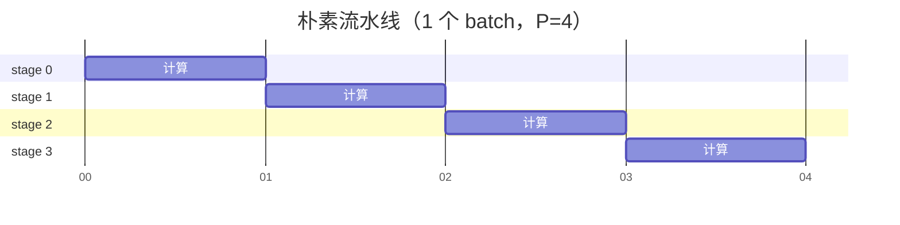
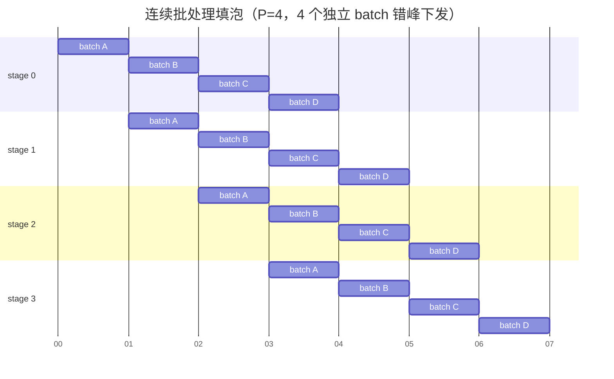
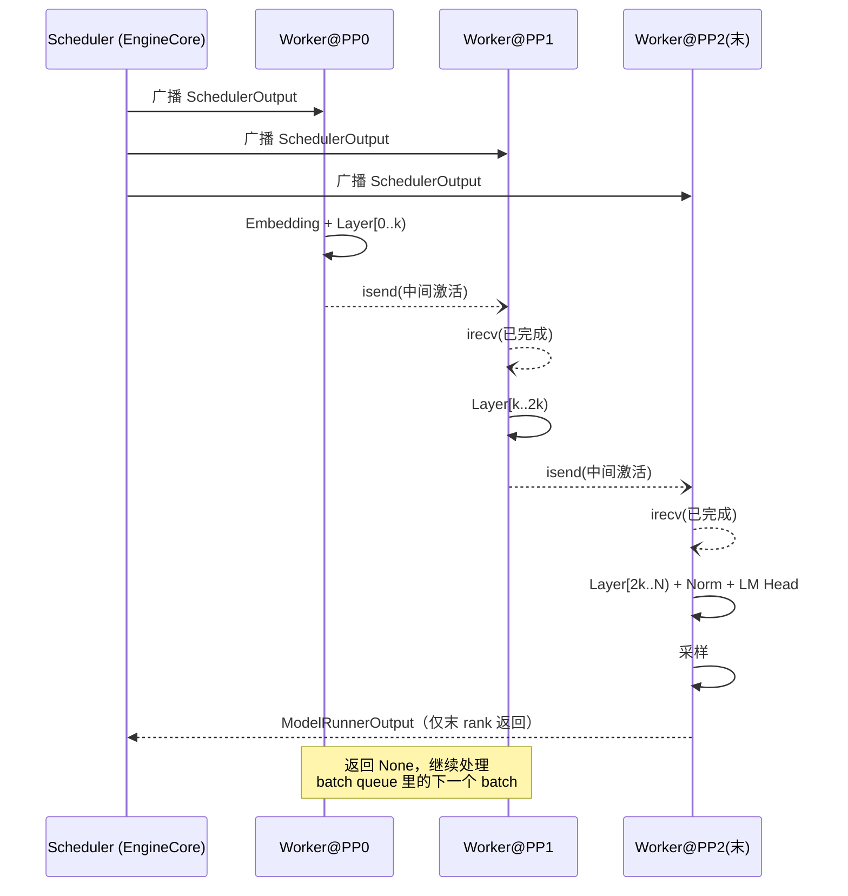
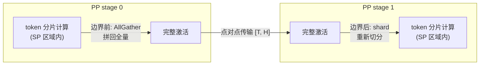

# PP 与 SP：方案与原理

> 本文介绍流水线并行（Pipeline Parallelism, PP）与序列并行（Sequence Parallelism, SP）的背景、原理，以及它们在 vLLM 与 vLLM-Ascend 中的演进。全文不涉及具体代码，代码层面的实现请阅读《PP_SP_代码走读》。
>
> 阅读前建议先了解 Transformer 的基本结构（Embedding → N × Decoder Layer（Attention + MLP/MoE）→ Norm → LM Head）。第 2 章从零讲清张量并行（TP）的切分与 AllReduce 机制——SP 的全部动机都藏在这条链路里；第 3 章顺势展开 SP，第 4 章再讲与之正交的 PP。

---

## 目录

1. [为什么推理系统需要多种并行](#1-为什么推理系统需要多种并行)
2. [前置知识：张量并行（TP）的切分与通信](#2-前置知识张量并行tp的切分与通信)
3. [序列并行（SP）原理](#3-序列并行sp原理)
4. [流水线并行（PP）原理](#4-流水线并行pp原理)
5. [SP 与 PP 的组合](#5-sp-与-pp的组合)
6. [在 vLLM 与 vLLM-Ascend 中的演进](#6-在-vllm-与-vllm-ascend中的演进)
7. [硬件视角：NPU 上的通信](#7-硬件视角npu-上的通信)
8. [小结](#8-小结)

---

## 1. 为什么推理系统需要多种并行

一个 LLM 推理服务要同时面对三类约束：

| 约束 | 表现 | 应对手段 |
| --- | --- | --- |
| **显存容量** | 权重 + KV Cache 放不进一张卡 | 把模型切开：TP / PP / EP |
| **算力/延迟** | 单卡算不动，TTFT/TPOT 不达标 | 多卡分摊计算：TP / SP / CP |
| **吞吐** | 单实例 QPS 不够 | 多副本：DP（或 PD 分离） |

不同的并行策略切的是张量的**不同维度**。把一个 Transformer 的计算抽象成 4 维张量运算（`[batch, seq, hidden, layer]` 加上专家维），各并行策略的切分对象是：

| 并行策略 | 切分对象 | 主要通信 | 典型用途 |
| --- | --- | --- | --- |
| TP（张量并行） | 权重的行/列（`hidden` 维） | 每层 2 次 AllReduce | 单节点内扩算力 |
| PP（流水线并行） | **层（`layer` 维）** | 相邻 stage 间点对点传激活 | 跨节点扩容量 |
| DP（数据并行） | 请求（`batch` 维） | 无（副本间独立） | 扩吞吐 |
| EP（专家并行） | MoE 的专家 | All-to-All | 大 MoE 专家放不下 |
| SP（序列并行） | **token（`seq` 维）** | AllGather / ReduceScatter | 减少冗余计算与通信 |
| CP（上下文并行） | 序列（`seq` 维，attention 内部） | 注意力内 AllGather | 超长序列 prefill |

本文聚焦其中两个：

- **SP 切"宽度"**：同一个 batch 的 token 按序列维度切成 N 份，每张卡只处理自己那份 token 的部分计算——它是对 TP 副作用的修正，紧接第 2 章展开；
- **PP 切"深度"**：第 0~30 层放 0 号机组，第 31~60 层放 1 号机组，激活值像流水线一样流过去——它与 SP 正交，是扩容量的手段。

一句话概括两者的定位差异：

> **SP 是"效率"技术**——让 TP/EP 拓扑下被白白重复的计算和通信消失；
> **PP 是"容量"技术**——让放不下的模型放得下，让通信待在节点内。

---

## 2. 前置知识：张量并行（TP）的切分与通信

SP 要解决的问题，是 TP 的一个副作用引起的。要看清这个副作用，得把 TP 的完整链路走一遍：**权重怎么切 → 每张卡算出什么 → AllReduce 怎么把它变成正确结果 → 这个结果里藏着什么浪费**。

本章用一个贯穿始终的小例子：TP=2（两张卡）、4 个 token、hidden=4、输出通道 8。

### 2.1 TP 怎么切分：列切 + 行切

一个线性层就是一次矩阵乘法 `Y = X·W`：输入 `X` 是 `[4, 4]`（4 token × 4 输入通道），权重 `W` 是 `[4, 8]`（4 输入通道 × 8 输出通道）。TP 把 `W` 切成两半给两张卡，有两种切法，性质恰好互补。

**列切（Column Parallel）：沿输出通道（列）切 W**

```text
              W [4, 8]
              ┌────────────┬────────────┐
              │  W0 [4, 4] │  W1 [4, 4] │
              └────────────┴────────────┘
               rank0 拿 W0    rank1 拿 W1

rank0: Y0 = X · W0 → [4, 4]    ← Y 的前 4 个输出通道
rank1: Y1 = X · W1 → [4, 4]    ← Y 的后 4 个输出通道
```

- 每张卡的输出**本身就是正确值**：Y0 和 Y1 是不同输出通道上的数，不是"部分和"，无需相加、无需通信；
- 代价是**输入必须完整**：W0 的每一列都要用到 X 的全部 4 个输入通道，X 缺任何一列都算不了。

**行切（Row Parallel）：沿输入通道（行）切 W，X 跟着切**

```text
              W [4, 8]                    X [4, 4]
              ┌────────────┐             ┌──────────┬──────────┐
              │ W0' [2, 8] │             │ X0' [4,2]│ X1' [4,2] │
              ├────────────┤             └──────────┴──────────┘
              │ W1' [2, 8] │           rank0 拿 X0'     rank1 拿 X1'
              └────────────┘

rank0: Y0' = X0' · W0' → [4, 8]    ← 部分和
rank1: Y1' = X1' · W1' → [4, 8]    ← 部分和
```

为什么输出是部分和、为什么加起来恰好就是完整结果？分块矩阵乘法一行写完：

```text
Y = X·W = [X0' | X1'] · [W0' ; W1'] = X0'·W0' + X1'·W1' = Y0' + Y1'
```

（`[X0' | X1']` 按列拼、`[W0' ; W1']` 按行拼，内维对齐，展开就是两个小矩阵乘积之和。）

行切的特点与列切正好相反：

- **输入不需要完整**：W0' 只用到 X 的前 2 个输入通道，恰好就是 rank0 手里的 X0'，不用任何通信；
- **输出是部分和**：必须跨卡相加才是正确结果——这次躲不掉了，需要一次 **AllReduce**（下文简称 AR）。

**Transformer 里两者成对出现**

```text
Attention:  X ─[QKV 投影·列切]→ attention ─[o_proj·行切]→ (+) ─AR→ Y
MLP:        X ─[gate/up·列切]→ act ─[down·行切]→ (+) ─AR→ Y
```

配对得如此整齐不是巧合：

- QKV 投影列切后，每张卡拿到自己那份 head 的 Q/K/V，attention 各算各的 head，互不干扰；
- attention 的输出每卡只有自己 head 的那些通道——恰好就是 o_proj 行切所要求的"输入通道分块"，**中间零通信**；
- o_proj（行切）出口的部分和必须相加，于是产生一次 AllReduce。

第一个基础事实到手：**每层 attention 出口一次 AR、MLP 出口一次 AR，即"每层 2 次 AllReduce"**。

### 2.2 AllReduce 怎么生效

行切出口处，每张卡各持一张部分和矩阵。

```text
rank0 的部分和 Y0':    rank1 的部分和 Y1':    正确结果 Y = Y0' + Y1':
[ 1  2 ]              [ 3  1 ]               [ 4  3 ]
[ 0  1 ]              [ 2  2 ]               [ 2  3 ]
[ 5  0 ]              [ 1  4 ]               [ 6  4 ]
[ 2  3 ]              [ 0  1 ]               [ 2  4 ]
```

**AllReduce 的语义 = 按元素求和 + 结果人手一份**：做完之后，两张卡都持有完整的 Y。

主流实现（Ring-AR）分两圈：

1. **第一圈，求和**：数据切块沿环流动，每卡收到邻居的块就累加再转发。转完 N-1 步，和已经全部算出——**但是分布着的**：每张卡完整持有"某一块"的最终和；
2. **第二圈，广播**：这些已经求完和的块沿环再转一圈，拼成人手一份的完整结果。

记住这两圈的名字：第一圈叫 **ReduceScatter**，第二圈叫 **AllGather**。Ring-AR 本来就是这两段拼起来的——2.4 的等价性直接建立在这个事实上。

于是有了本章第一个关键事实：

> **AR 完成后，每张卡上都持有完整的激活：全量 token × 全量 hidden，N 张卡一模一样。**

### 2.3 冗余在哪里：AR 之后发生了什么

从 o_proj 的 AR 出发，到下一次"真正需要通信"之前，模型还要做的事是：

```text
o_proj AR → (+ residual) → RMSNorm → 下一层 QKV 投影 → attention → …
```

逐个检查这些算子**到底需要什么输入**：

| 算子 | 真正需要的输入 | 原因 |
| --- | --- | --- |
| residual add / RMSNorm / RoPE / Router 门控 | 只要当前 token 自己那一行 | **token 级（逐行）算子**：第 i 行的输出只依赖第 i 行 |
| 线性层（QKV 投影等） | hidden 维完整（输入通道），**token 维任意** | 同样逐行独立：Y 的第 i 行 = X 的第 i 行 · W |
| attention | 同一序列**所有 token** 的 Q/K/V | softmax(QKᵀ) 让每个 token 依赖其他 token——层内第一个真正的**跨 token** 算子 |

也就是说：从 AR 出发到 attention 入口之间的所有算子，对 token 维**完全没有要求**。而 RS 的输出恰好是 `[T/N, H]`——hidden 完整、token 只剩 1/N，直接就能喂给它们。"人人全量"这个形态，要到 attention 入口才第一次被真正需要。

AR 不管这些，它一步把"求和"和"人手全量"都做了。于是产生两层浪费：

**浪费一：计算冗余。** AR 之后每卡都是全量 token，residual/Norm/Router 全是逐行算子，N 张卡各自把全量行算了一遍——同样的结果被算 N 遍，其中 N-1 遍是纯浪费。

**浪费二：全量形态出现得太早。** 把 AR 拆开看（2.2 的两圈）：求和必须立刻做，这是行切出口的数学要求；但"人手全量"（AG 那一圈）搬来的行，要到 attention 入口才第一次被消费。AG 发生在 o_proj 出口，中间夹着的逐行算子被迫在"别人家的行"上重复劳动。**全量的激活出现得太早，完全可以推迟到后续。**

这就是本章第二个关键事实：

> **AR 对后续计算真正必要的部分只有"求和"；"人人全量"只在 attention 入口才被需要。**

### 2.4 ReduceScatter + AllGather 为什么和 AllReduce 等价

两个算子的定义（N 卡，矩阵沿 token 维均分成 N 块行）：

- **ReduceScatter（RS）**：把 N 张卡上的矩阵按元素求和，然后按行分家——rank i 只拿走求和结果的第 i 块；
- **AllGather（AG）**：每卡把自己那块行发出去，所有块按行拼接，人手一份完整矩阵。

用 2.2 的数字走一遍（2 卡，上下两半分家）：

```text
第 1 步，RS（求和 + 分家）：
  S = Y0' + Y1'：         分家后：
  [ 4  3 ]                rank0 拿 S 的前 2 行： [ 4  3 ]
  [ 2  3 ]                                       [ 2  3 ]
  ────────                rank1 拿 S 的后 2 行： [ 6  4 ]
  [ 6  4 ]                                       [ 2  4 ]
  [ 2  4 ]

第 2 步，AG（拼回全量）：
  rank0 持有前 2 行 ┐
  rank1 持有后 2 行 ┘→ 两卡都得到 S = [4 3; 2 3; 6 4; 2 4]
```

对照 AllReduce 的定义（人手一份 S）：**一字不差**。写成公式：

```text
AR(X0, X1, …, Xn-1)  =  AG( RS(X0, X1, …, Xn-1) )
```

两个视角都成立：

- **结果视角**：AR 给每人完整 S；RS 先给每人 S 的 1/N，AG 再拼回——终态相同；
- **实现视角**：2.2 已看到，Ring-AR 内部本来就是 RS + AG 两圈。这不是巧合，是同一个算法的两种打开方式。

通信量的账（Ring、数据体积 V、N 卡）：

| 操作 | 每卡收发量 |
| --- | --- |
| AR（两圈） | 2 × (N-1)/N × V |
| RS（一圈） | (N-1)/N × V |
| AG（一圈） | (N-1)/N × V |
| **RS + AG 合计** | **2 × (N-1)/N × V —— 与 AR 完全相同** |

所以，**用 RS + AG 替换 AR 不是通信优化**，总通信量一字节不少。它的真正含义是：**把一次通信拆成两半，在两半之间获得一段"token 分片"的区间，可以往里面塞分片计算。**

### 2.5 把账拼起来：为什么这样是赚的

到此 SP 的所有零件都齐了：浪费的定位（2.3）+ 等价的替换（2.4）。做法一句话：**行切出口只做 RS，把 AG 推迟到 attention 入口**。



两条路径的通信总量相同（2.4 的账本），差别只在"逐行算子区间"里干的是什么活。收益逐条对应：

1. **逐行算子计算量 ÷ N**——浪费一消失；
2. **层内激活显存 ÷ N**——分片区间内每卡只保留自己那份激活，推理的中间张量、训练的 checkpoint 都受益；
3. **全量形态不再提前**——AG 推迟到 attention 入口，拼回来的全量是 attention 真正要用的，一行都不浪费（浪费二消失）；
4. **通信边界变活**——RS/AG 各只剩 AR 一半的体量，可以贴着前后算子做**融合 kernel**（如 RS+Norm、quant+AG，Kimi K3 上还有 o_proj+RS 融合），这是昇腾上 SP 的主要性能来源之一；
5. **MoE 的额外大礼**——进入 MoE 区域时 token 已是分片形态，dispatch/combine 不再按全量 token 重复做。推理场景这笔往往是大头，3.1 展开。

代价：一次通信变两次（多一个同步点）、token 数须被 N 整除（padding 兜底，3.5）、attention 两侧必须严格切回全量。

第 3 章就把这个替换落到 vLLM：Megatron 式的经典 SP，以及围绕 MoE 边界的 SP-MoE。

---

## 3. 序列并行（SP）原理

### 3.1 动机：第三笔账——MoE 的重复 dispatch

第 2 章算过两笔账：AR 之后人人全量，逐行算子被 N 张卡重复计算（浪费一）；全量形态出现得太早，AG 搬来的行先被喂进重复劳动（浪费二）。把 AR 拆成"RS + 分片计算 + AG"，这两笔账一笔勾销（2.4、2.5）。

推理场景还有第三笔账，而且往往是大头：

**MoE + EP 下的重复 dispatch。** MoE 层接在 o_proj AR 之后，输入是全量 token；开启 EP 后专家分散在各卡。如果直接把全量 token 送进 dispatch（All-to-All），同一个 token 会被每个 EP rank 都发一遍/算一遍本可以只算一次的部分，通信量和计算量都按副本数放大。

SP 对这三笔账是"一次拆分，全部生效"：token 分片区间内，逐行算子只算 1/N、激活只存 1/N、MoE 只处理 1/N 的 token。

### 3.2 Megatron 式 SP：把"AR 之后"的部分切掉

训练框架（Megatron-LM）的经典解法，就是 2.5 的那句话：**在 o_proj 出口不做完整 AR，只做 ReduceScatter；AG 推迟到下一个 attention 入口**。

- RS 之后，每张卡持有"求和结果"的 **1/N 行**——即 token 维度的切片；
- LayerNorm 等 token 级算子只处理自己那 1/N 的 token（浪费一消失）；
- attention 需要看到完整 batch 的所有 token（不同 token 之间要互相注意），所以进 attention（连同紧贴它的 QKV 投影）之前，做一次 AllGather 拼回全量。



换个角度看这个改法：SP 没有发明任何新通信，只是把"AR = RS + AG"（2.4）里的 **AG 从 attention 出口搬到了下一层 attention 入口**，中间夹着的 token 级算子从全量计算变成分片计算。通信总量不变，计算量与激活显存降为 1/N——收益账见 2.5。

### 3.3 推理场景的 vLLM 路线：围绕 MoE 边界做 SP

推理的负载特征与训练不同：decode 阶段一个 step 往往只有几十~几百个 token，LayerNorm 这类算子的重复计算不是大头；**大头是 MoE 模型里 EP dispatch 的重复通信与计算**。因此 vLLM 的 SP 落地以 **SP-MoE** 为主：

vLLM 上游最初的设计里，SP-MoE 的启用条件是 **DP > 1 + EP + TP > 1 + all2all backend 支持**：多个 DP 副本各自持有不同的请求，MoE 前把各 DP rank 的 token 汇总（AllGather）再 dispatch，算完再散回（ReduceScatter），避免每个副本独立做全量 dispatch。

vLLM-Ascend 把这个条件扩展到了 **DP = 1 的纯 TP/EP 拓扑**（详见 6.2），这也是当前昇腾上 SP 的主要形态：单副本内，TP 各 rank 在 MoE 区域各持 1/N 的 token。

### 3.4 SP-MoE 的完整数据流

一个 MoE Transformer 层在 SP 打开后的完整数据流（以 TP=2、EP 开启为例）：



文字版（`AG`=AllGather，`RS`=ReduceScatter，`AR`=AllReduce）：

```text
不开 SP:  Attn → TP AR → Norm/Router → (全量 token) MoE → …（每 rank 重复处理全量 token）
开了 SP:  TP AG → Attn → TP RS → Norm/Router → EP AG → MoE → EP RS → …（每 rank 只处理 1/N token）
```

两个工程细节值得注意：

1. **为什么 EP AG 能"合并" TP AG 和 DP AG**：EP 组在 rank 排布上覆盖了 TP×DP 的卡，一次 EP 域的 AllGather 同时完成了"TP 内拼 token"和"DP 间拼 token"两件事，比做两次小集合通信更高效。vllm-ascend 中 SP-MoE 的 `prepare`（入口）/`finalize`（出口）就实现了这条合并路径。
2. **attention 前后必须回到全量**：attention 的输出对每个 token 依赖所有其他 token（的 KV），无法在 token 分片下直接计算，所以 SP 区域以 attention 为界——进 attention 前 AG，出 attention 后 RS。这就是"围绕通信边界切 token"的含义。

仓库中官方的 SP-MoE 示意图（`sp_moe.png`，展示了 token 分片在层间的流转，蓝/绿两色代表两个 TP rank 各自的 token 分片）：



### 3.5 Padding：token 数不整除怎么办

SP 要求"每 rank 的 token 数相同"，但实际 batch 的 token 数 `T` 未必是 TP 数 `N` 的倍数。两套对策（vllm-ascend 两种都用）：

1. **补齐（pad）**：把 `T` 向上取整到 `N` 的倍数，补的行是假 token；每个 rank 拿到等长的分片。配套需要一个 **padding mask**（`is_padding`）标记哪些行是假的，防止假 token 污染计算（例如 router 把假 token 路由给专家、norm 统计被假行带偏）。
   - 调度侧还有一个配套约束：`max_num_batched_tokens` 应能被 `TP × PCP` 整除，否则框架会自动向上调整并告警。
2. **跳过（skip padding）**：MoE dispatch 时把 padding 行的 expert id 置为 `-1` 哨兵值，dispatch 和专家计算直接丢弃这些行，不做无用功（vLLM 的 `VLLM_MOE_SKIP_PADDING`，默认开启）。

### 3.6 SP 与 CP 的区别

SP 和 CP 都切 `seq` 维，容易混淆。区别在于**切完后 attention 怎么办**：

| | SP | CP（Context Parallel） |
| --- | --- | --- |
| 切分区间 | attention **之外**的 token 级算子（Norm/MLP/MoE/Router） | attention **内部**（Q/K/V、KV Cache 都按序列切） |
| attention 处理 | AG 拼回全量再算 | 各 rank 只算自己 query 分片，KV 需要跨 rank 交互（Ring/AllGather KV） |
| 解决的问题 | AR 后激活复制的冗余 | 超长序列单卡算力/显存不够 |
| 典型场景 | MoE 大模型 decode/prefill 提效 | 128K+ 长文本 prefill |

在 vllm-ascend 中两者会叠加使用（例如 DSA-CP 依赖 SP 的 token 布局），但概念上是正交的。

---

## 4. 流水线并行（PP）原理

SP 优化的是 TP 组内部的效率；PP 切的是另一个正交的维度——**层**。模型放不下、跨节点扩展这些问题，靠它解决（与 SP 的叠加见第 5 章）。

### 4.1 基本思想：按层切分

把 Transformer 的 N 层沿深度切成 P 段，每段叫一个 **stage**，由一组卡（通常是一个 TP 组）负责。数据像流水线上的工件一样从 stage 0 流到 stage P-1：



各 stage 的分工：

| Stage | 额外持有 | 说明 |
| --- | --- | --- |
| 首 stage | Embedding | token id → 向量 |
| 中间 stage | 无 | 纯 Decoder Layer |
| 末 stage | Final Norm、LM Head、采样 | logits 计算和采样只发生在最后一个 stage |

**KV Cache 也按层切分**：每个 stage 只为自己负责的那几层分配 KV Cache，这是 PP 节省显存的另一半来源（权重减半，KV Cache 也减半）。

### 4.2 流水线气泡（Bubble）

朴素流水线的问题是：同一时刻只有一个 stage 在干活。假设每个 stage 耗时 T，一个 batch 要走 P 个 stage，总耗时 P·T，但每个 stage 实际只干了 T 的活：



每个 stage 只在自己的时间片计算，其余时间全是空白——**空白区间就是流水线气泡**（横轴每格 = 一个时间单位 T）。气泡占比的朴素估计是 `(P-1)/M`（M 为在流水线中的独立 batch 数）——所以**填泡的基本思路永远是：让多个独立的 batch 同时在流水线里**。

### 4.3 训练与推理填泡方式的差异

**训练（GPipe / 1F1B / Interleaved）**：把一个大 batch 切成 M 个 micro-batch 依次喂入，反向传播与前向交错执行。气泡率约为 `(P-1)/(M)`，靠加大 M 压缩。

**推理（vLLM 的方式）**：推理没有反向传播，填泡的原料是**连续批处理（continuous batching）天然产生的独立"batch"**：

- 高并发时，调度器每一步都能凑出一个新 batch（decode step），相邻的 step 天然独立，可以错开下发给不同 stage；
- 长文本 prefill 被切块（chunked prefill）后，多个 chunk 也是天然独立的 micro-batch。

为此 vLLM V1 引擎维护了一个 **batch queue（in-flight micro-batching）**：调度器可以连续发送多个 batch 而不必等上一个 batch 走完全程，让不同 stage 同时处理不同 batch。队列深度自动推导：普通 PP 取 `pp_size`，MRV2 + 异步调度取 `pp_size + 1`——**这就是 vLLM 里消除 PP 气泡的机制**（详见代码走读 2.4 节）。



### 4.4 vLLM V1 的 PP 架构

vLLM V1 引擎的 PP 实现有几个值得注意的设计（与训练框架、与 V0 都不同）：

1. **调度器逻辑上是单点的**：一个 scheduler 进程负责排队、调度、更新请求状态；每一步产出一个 `SchedulerOutput`，通过执行器**广播**给所有 PP rank。
2. **每个 PP rank 只执行自己的 stage**：收到同样的 `SchedulerOutput` 后，rank i 只跑自己那几层。非首 rank 从上一个 rank 接收中间激活（异步 `irecv`），非末 rank 把输出中间激活异步 `isend` 给下一个 rank。
3. **只有末 stage 采样**：logits 计算与采样只在最后一个 stage 发生，采样结果作为引擎输出返回调度器更新请求状态。
4. **因为所有 rank 收到同样的调度输出、执行确定性的计算，中间不需要同步 token 采样结果**（V1 model runner 是无状态的；V2 model runner 有状态，需要额外把采样 token 广播回各 stage——见下）。



> **V2 Model Runner 的差异**：V2 runner 是**有状态**的（请求状态、KV 状态由 runner 自己维护），各 stage 必须知道"上一步采出的 token 是什么"才能推进自己的状态。因此 V2 增加了一个 `PPHandler`：末 stage 采样后，把 sampled tokens 通过一条独立的通信域广播回所有 stage（错开 pp_size 步消费，与隐藏态传输不抢同一根线）。

### 4.5 PP vs TP：什么时候选 PP

| 维度 | TP | PP |
| --- | --- | --- |
| 切分对象 | 层内权重 | 层间分组 |
| 通信模式 | 每层 2 次 AllReduce（高频集合通信） | 相邻 stage 1 次点对点（低频、量小：`num_tokens × hidden_size`） |
| 通信位置 | 分布在每个层内 | 只在 stage 边界 |
| 显存 | 权重+KV 按比例减少 | 权重+KV 按层减少 |
| 单请求延迟 | 所有 rank 并行算同一层，延迟好 | 请求需依次穿过所有 stage，延迟通常变差 |
| 吞吐 | 大 TP 组受集合通信拖累 | 高并发下多 batch 填泡，吞吐可以很好 |
| 放缩约束 | 受头数/KV 头数/hidden 整除限制 | 只要求模型能按层切 |

典型结论（也是 vllm-ascend 官方文档的建议）：

- **模型单节点放得下：优先纯 TP**，加 PP 前先 benchmark；
- **跨节点部署：节点内 TP + 节点间 PP**——把高频 AllReduce 关在节点内（HCCS/NVLink 域），stage 间走低频点对点。这是 PP 相对"大 TP 跨节点"的核心优势：**通信局部性**；
- PP 更适合高并发/长 prefill 的吞吐场景；低并发纯 decode 场景 PP 气泡占比高，通常不划算。

---

## 5. SP 与 PP 的组合

PP 传的是"完整激活"：stage i 把 `[T, H]` 的中间张量发给 stage i+1。而 SP 状态下，每张卡持有的激活是 `[T/N, H]` 的分片。两者组合时必须在 **stage 边界把 SP 区域"闭合"**：



也就是说，**PP 边界是一个"SP 区间外"的点**：

- 非 stage 边界处，层与层之间保持分片流转（省计算省显存）；
- stage 边界处，发送方 AllGather 拼回全量再发，接收方收到后再 shard 一次进入自己的 SP 区域。

这样设计的理由是解耦：PP 传输协议不需要理解 SP 的分片语义，永远处理"每个 TP rank 内容一致"的复制张量；SP 的开闭对 PP 完全透明。代价是边界处多一次 AG + shard，但一个 stage 边界只发生一次，摊到几十层上可以忽略。

另一个组合细节：不开 SP 时，stage 边界的中间张量在各 TP rank 上虽然内容一致但逻辑上是独立的，vLLM 允许发送时顺带做一次 TP 域去重（只从 rank 0 发、其余 rank 靠 TP AllGather 补齐，即 `all_gather_group` 参数）；开了 SP 后由于边界处已经规约为复制张量，直接全员参与点对点即可。

---

## 6. 在 vLLM 与 vLLM-Ascend 中的演进

### 6.1 vLLM 上游

**SP：**

| 阶段 | 时间 | 内容 |
| --- | --- | --- |
| 无 SP 期 | ~2025 中 | 推理场景没有标准 SP；MoE 的 token 去重依赖各 all2all backend 自行处理 |
| 编译期 SP | 2025 末~2026 | torch.compile 全图模式下引入 **SP fusion pass**：模式匹配 `AR + LayerNorm` 等模式自动替换为 `RS + LN + AG`，按硬件算力/hidden size 自动判定阈值——仅 CUDA/XPU 路径生效 |
| 标准算子期 | 2026 | 引入**通用 SP 算子**（`sp_all_gather` / `sp_reduce_scatter` / `sp_shard` / `sp_padding_mask`），模型显式接入；MoE 侧以 `use_sequence_parallel_moe` 统一各 all2all backend 的 SP 判定（要求 DP>1） |

**PP：**

| 阶段 | 时间 | 内容 |
| --- | --- | --- |
| V0 时代 | 2023~2024 | 继承自训练式实现的 PP：单调度器 + 虚拟流水线 micro-batch（`AsyncScheduler` 前身），通过 `broadcast_tensor_dict` 同步采样结果，实现重、路径多 |
| V1 重构 | 2024 下半年 | V1 引擎上线时**暂时移除 PP**，只保留 TP/DP——V0 的 PP 与 V1 的 core-loop 不兼容 |
| V1 重新支持 | 2025 | 以 V1 的方式重新实现：调度器单点广播 `SchedulerOutput`、各 rank 只执行自己 stage、**batch queue**（in-flight micro-batching）消除气泡、采样只在末 rank |
| 完善 | 2025~2026 | 支持 PP×speculative decoding（MTP/EAGLE3/DSpark，drafter 挂在末 stage）、PP×P/D 分离（prefill 侧 PP）、异步 `irecv/isend` 与计算重叠 |
| V2 Model Runner | 2026 | 有状态 runner 下的 PP：`PPHandler` 负责把 sampled tokens 广播回各 stage（错步消费）；`IntermediateTensors` 扩展为可携带辅助数据（aux hidden states 等）的通用传输通道 |

### 6.2 vLLM-Ascend：FlashComm 的兴衰

vLLM-Ascend 的 SP 历史是一条"自研 → 上游化"的典型路径：

| 时间 | 事件 | 意义 |
| --- | --- | --- |
| 2025-07 (v0.9.1) | **FlashComm v1** 合入：Qwen2.5（dense）/ Qwen3（MoE）率先支持 | 昇腾第一代推理 SP：AG/RS 替代 AR + MoE token 分片 |
| 2025-09 | dense 与 MoE 的 SP 特性统一为一套方案（#3085） | FlashComm 成为通用开关 `VLLM_ASCEND_ENABLE_FLASHCOMM1` |
| 2025-11 | **FlashComm v2**（#3232）：**以存换通信**——o_proj 权重在每卡冗余存放，使 o_proj 输出天然处于"分片"形态，省掉 RS | 用显存换通信的第二代方案 |
| 2026-01 | FlashComm2 + Oshard（#4723）：o_proj 权重逐层分散 + 异步广播，缓解 v2 的显存压力 | v2 的补丁形态 |
| 2026-07 | **FlashComm v2 / layer sharding 整体移除**（#11953、#12117） | 上游标准 SP 算子已足够，"以存换通信"失去存在意义 |
| 2026-07-30 | Kimi K3 支持（#12950）：**直接基于上游标准 SP 算子**实现模型级 SP（dense MLP + attention + MoE 全覆盖） | 新模型不再走 FlashComm 私有路径 |
| 2026-09 | SP-MoE 官方指南 + FlashComm 语义收窄为"SP 开关"（#15737）；**MoE SP 支持 DP=1**（#17061，patch 掉上游的 DP>1 限制） | 昇腾 SP 与上游路径实质合流 |
| 2026-10 | 文档层面 `VLLM_ASCEND_ENABLE_FLASHCOMM1` 环境变量退役，统一为 `additional_config.enable_flashcomm1`（#17981） | 名字还叫 FlashComm，实际上已经是上游标准算子 |

**当前状态（2026-10，main 分支）的准确理解**：

- "FlashComm1" 这个名字如今只是 **SP-MoE 的总开关**。打开它，框架把 MoE 的 all2all backend 切到 `allgather_reducescatter`，从而触发 `use_sequence_parallel_moe` 判定；底层执行的是上游标准 SP 算子 + 昇腾的 custom op 封装。
- 关闭它时，all2all backend 被强制切到 `flashinfer_all2allv`（一条不走 SP 的路径），MoE 回到"全量 token 重复处理"的模式。
- FlashComm **v2（以存换通信）已不存在**，遇到旧资料提到的 `VLLM_ASCEND_FLASHCOMM2_PARALLEL_SIZE` / `layer_sharding` 可直接忽略。

**为什么走上游化**：私有 SP 需要为每个模型单独适配（FlashComm 时期每个新模型都要一轮 "Support Flash Comm V1 for XXX" 的 PR，且 bug 高发——NaN、维度不匹配、与图模式冲突等专项修复贯穿了整个 2025 下半年）。上游标准算子把 SP 语义收敛到 4 个原语后，模型接入成本和回归风险都大幅下降。这是基础设施演进的普遍规律：**私有优化 → 上游标准化 → 私有侧只剩开关和硬件适配**。

### 6.3 PP 在 vLLM-Ascend 的演进

vLLM-Ascend 的 PP 基本跟随上游架构（V1 广播式执行、batch queue 填泡），自身的工作集中在：

1. **通信后端适配**：stage 间点对点（send/recv）与集合通信跑在 HCCL 上；
2. **模型侧 PP 化**：DeepSeek-V4/V4.1、GLM-5.2、MiniMax-M3、Kimi K3 等模型的 Ascend 实现提供 `SupportsPP` 支持（上游实现继承 `SupportsPP` 的模型自动可用）；
3. **特性叠加矩阵**：PP×MTP、PP×DSpark/EAGLE3（drafter 的 aux hidden states 跨 stage 接力）、PP×P/D（prefill 侧 PP）、PP×KV offload 等；
4. **DCPP（Dynamic Chunked Pipeline Parallel）**：昇腾特有的 prefill 优化——按实测执行时间动态调整 chunk 大小，减少长文本 prefill 时 stage 空转；
5. **MRV2（Model Runner V2）下的 PP**：`pp_transport` 机制让 `IntermediateTensors` 可以携带 spec decode 需要的辅助张量跨 stage 传输。

---

## 7. 硬件视角：NPU 上的通信

PP 与 SP 的性能表现最终取决于通信原语在硬件上的行为。昇腾侧的几个要点：

| 概念 | 说明 | 与本文的关联 |
| --- | --- | --- |
| HCCS | 节点内 NPU 间高带宽互联（对标 NVLink） | "节点内 TP、节点间 PP"策略的物理基础：AllReduce 留在 HCCS 域内 |
| RoCE / 参数面网络 | 跨节点通信，带宽低于 HCCS | PP 把跨节点通信压缩为低频点对点小包；跨节点 MoE 的 all2all 则较贵（这也是 SP/EP拓扑选择的影响因素） |
| HCCL | 华为集合通信库（对标 NCCL），提供 AR/AG/RS/All-to-All/send/recv | PP 的 `isend/irecv`、SP 的 AG/RS 都由 HCCL 执行；torch 层通过 `torch.distributed` 的 hccl backend 调用 |
| 通信-计算重叠 | 多 stream + 异步集合通信 | PP 的异步收发（收上一步激活的同时算当前步）、SP 的 custom AG/RS（底层异步、融合）都依赖这一点 |
| 融合算子 | 通信与计算融合进一个 kernel（如 AllReduce+RMSNorm、AG+量化） | SP 路径中 quant → AG 的融合、K3 的 o_proj+ReduceScatter 融合，是 SP 在昇腾上的主要性能来源之一 |

一个值得记住的量化直觉（用于容量规划，非精确值）：

- PP 每个 step 的 stage 间通信量 ≈ `num_tokens × hidden_size × dtype_size`（一次激活传输），与层数无关；
- TP 每层 2 次 AllReduce，每次通信量 ≈ `2 × num_tokens × hidden_size × dtype_size × (N-1)/N`；
- 所以层数越多、TP 越大，PP 的通信局部性优势越明显；反过来，层数少的小模型上 PP 收益有限。

---

## 8. 小结

| | SP | PP |
| --- | --- | --- |
| 一句话 | 用 RS + AG 替换 AR，token 级计算只处理 1/N 的 token | 按层切模型，激活像流水线一样流过各 stage |
| 收益 | 消除冗余计算/通信（MoE 重复 dispatch）、层内激活显存 1/N | 显存容量（权重+KV 按层分）、通信局部性（跨节点只剩点对点） |
| 代价 | 通信模式复杂化（AR → AG+RS）、padding 处理、对图模式/模型接入有要求 | 流水线气泡、单请求延迟上升 |
| 关键机制 | 围绕 attention 边界 AG/RS、EP 域合并通信、padding mask/skip | batch queue 填泡、异步 isend/irecv、末 stage 独占采样 |
| 组合方式 | | stage 边界 = SP 区间外（先 AllGather 回全量再传） |

下一篇《PP_SP_代码走读》将带着这些概念进入代码：从 `enable_flashcomm1` 开关一路走到 MoE 层里的 AG/RS，从 `--pipeline-parallel-size` 参数一路走到 stage 间的张量传输。

---

## 参考文献

- vLLM-Ascend 官方文档：[Pipeline Parallelism](https://docs.vllm.ai/projects/ascend/en/latest/user_guide/feature_guide/pipeline_parallel.html)、[Sequence Parallelism](https://docs.vllm.ai/projects/ascend/en/latest/user_guide/feature_guide/sequence_parallelism.html)
- vLLM-Ascend 官方文档：[Dynamic Chunked Pipeline Parallel](https://docs.vllm.ai/projects/ascend/en/latest/user_guide/feature_guide/dynamic_chunk_pipeline_parallel.html)
- Megatron-LM: [Reducing Activation Recomputation in Large Transformer Models](https://arxiv.org/abs/2205.05198)（SP 的原始论文，Megatron 式 SP）
